# Database Schema Documentation

## Overview
This document provides a comprehensive overview of the custom database tables for the Schedule Management API, excluding default Laravel system tables.

## Tables and Relationships

### 1. **users**
Core user table with profession-related extensions.

| Field | Type | Constraints | Description |
|-------|------|------------|-------------|
| id | bigInteger | PRIMARY KEY, AUTO_INCREMENT | Unique user identifier |
| name | string | NOT NULL | User's full name |
| email | string | UNIQUE, NOT NULL | User's email address |
| email_verified_at | timestamp | NULLABLE | Email verification timestamp |
| password | string | NOT NULL | Hashed password |
| remember_token | string(100) | NULLABLE | Remember me token |
| profession_id | bigInteger | NULLABLE, FOREIGN KEY → professions.id | User's profession |
| profession_level | enum | NULLABLE | Level: student, resident, junior, senior, expert |
| workplace | string | NULLABLE | User's workplace |
| department | string | NULLABLE | User's department |
| work_schedule | json | NULLABLE | User's work schedule configuration |
| work_habits | json | NULLABLE | User's work habits and preferences |
| notification_preferences | json | NULLABLE | Notification settings |
| is_active | boolean | DEFAULT true | Account active status |
| created_at | timestamp | NOT NULL | Record creation timestamp |
| updated_at | timestamp | NOT NULL | Record update timestamp |

**Relationships:**
- Belongs to: `professions` (Many-to-One)
- Has many: `events`, `event_categories`, `smart_notifications`, `ai_processing_logs`, `user_analytics`, `raw_schedule_imports`, `admin_activities`
- Has one: `user_schedule_preferences`

---

### 2. **professions**
Professional categories that define user types and behaviors.

| Field | Type | Constraints | Description |
|-------|------|------------|-------------|
| id | bigInteger | PRIMARY KEY, AUTO_INCREMENT | Profession identifier |
| name | string | UNIQUE | Profession code name |
| display_name | string | NOT NULL | Display name |
| description | text | NULLABLE | Profession description |
| default_categories | json | NULLABLE | Default event categories |
| default_priorities | json | NULLABLE | Default priority settings |
| ai_keywords | json | NULLABLE | AI detection keywords |
| created_at | timestamp | NOT NULL | Creation timestamp |
| updated_at | timestamp | NOT NULL | Update timestamp |

**Relationships:**
- Has many: `users`, `event_types`, `schedule_templates`, `parsing_rules`, `schedule_import_templates`, `user_analytics`, `system_settings`

---

### 3. **event_types**
Profession-specific event type definitions.

| Field | Type | Constraints | Description |
|-------|------|------------|-------------|
| id | bigInteger | PRIMARY KEY, AUTO_INCREMENT | Event type identifier |
| profession_id | bigInteger | FOREIGN KEY → professions.id | Associated profession |
| name | string | NOT NULL | Type name |
| display_name | string | NOT NULL | Display name |
| description | text | NULLABLE | Type description |
| color | string(7) | NULLABLE | Hex color code |
| icon | string | NULLABLE | Icon identifier |
| default_priority | integer | DEFAULT 3 | Default priority |
| ai_priority_weight | decimal(3,2) | DEFAULT 1.00 | AI priority weight |
| keywords | json | NULLABLE | Detection keywords |
| requires_preparation | boolean | DEFAULT false | Requires preparation |
| preparation_days | integer | DEFAULT 0 | Preparation days |
| default_duration_minutes | integer | DEFAULT 60 | Default duration |
| allows_conflicts | boolean | DEFAULT false | Allow scheduling conflicts |
| is_recurring_allowed | boolean | DEFAULT true | Allow recurrence |
| created_at | timestamp | NOT NULL | Creation timestamp |
| updated_at | timestamp | NOT NULL | Update timestamp |

**Unique Constraint:** [profession_id, name]

**Relationships:**
- Belongs to: `professions` (Many-to-One)
- Has many: `event_categories`

---

### 4. **event_categories**
User-specific event categories based on event types.

| Field | Type | Constraints | Description |
|-------|------|------------|-------------|
| id | bigInteger | PRIMARY KEY, AUTO_INCREMENT | Category identifier |
| user_id | bigInteger | FOREIGN KEY → users.id | Owner user |
| event_type_id | bigInteger | NULLABLE, FOREIGN KEY → event_types.id | Associated event type |
| name | string | NOT NULL | Category name |
| display_name | string | NOT NULL | Display name |
| description | text | NULLABLE | Category description |
| color | string(7) | NULLABLE | Hex color code |
| icon | string | NULLABLE | Icon identifier |
| priority | integer | DEFAULT 3 | Default priority |
| ai_priority_weight | decimal(3,2) | DEFAULT 1.00 | AI priority weight |
| custom_keywords | json | NULLABLE | Custom keywords for AI |
| preparation_days | integer | DEFAULT 0 | Preparation days required |
| is_active | boolean | DEFAULT true | Active status |
| created_at | timestamp | NOT NULL | Creation timestamp |
| updated_at | timestamp | NOT NULL | Update timestamp |

**Relationships:**
- Belongs to: `users` (Many-to-One), `event_types` (Many-to-One, optional)
- Has many: `events`, referenced by `user_schedule_preferences`

---

### 5. **events**
Core events/schedule entries.

| Field | Type | Constraints | Description |
|-------|------|------------|-------------|
| id | bigInteger | PRIMARY KEY, AUTO_INCREMENT | Event identifier |
| user_id | bigInteger | FOREIGN KEY → users.id | Owner user |
| title | string | NOT NULL | Event title |
| description | text | NULLABLE | Event description |
| start_datetime | datetime | NOT NULL | Start date and time |
| end_datetime | datetime | NOT NULL | End date and time |
| location | string | NULLABLE | Event location |
| status | enum | DEFAULT 'scheduled' | Status: scheduled, in_progress, completed, cancelled, postponed |
| event_category_id | bigInteger | NULLABLE, FOREIGN KEY → event_categories.id | Event category |
| priority | integer | DEFAULT 3 | Priority level |
| ai_calculated_priority | decimal(5,2) | NULLABLE | AI-calculated priority |
| importance_score | decimal(5,2) | NULLABLE | Importance score |
| event_metadata | json | NULLABLE | Additional metadata |
| participants | json | NULLABLE | Participant list |
| requirements | json | NULLABLE | Event requirements |
| preparation_items | json | NULLABLE | Preparation checklist |
| completion_percentage | integer | DEFAULT 0 | Completion percentage |
| recurring_pattern | json | NULLABLE | Recurrence pattern |
| parent_event_id | bigInteger | NULLABLE, FOREIGN KEY → events.id | Parent event for recurring |
| created_at | timestamp | NOT NULL | Creation timestamp |
| updated_at | timestamp | NOT NULL | Update timestamp |

**Indexes:**
- idx_user_datetime: [user_id, start_datetime]
- idx_user_status: [user_id, status]
- idx_datetime_range: [start_datetime, end_datetime]

**Relationships:**
- Belongs to: `users` (Many-to-One), `event_categories` (Many-to-One, optional), `events` (Many-to-One, self-referencing for parent)
- Has many: `smart_notifications`, `events` (child events), referenced by `raw_schedule_entries`

---

### 6. **smart_notifications**
Advanced notification system with AI features.

| Field | Type | Constraints | Description |
|-------|------|------------|-------------|
| id | bigInteger | PRIMARY KEY, AUTO_INCREMENT | Notification identifier |
| event_id | bigInteger | NULLABLE, FOREIGN KEY → events.id | Related event |
| user_id | bigInteger | FOREIGN KEY → users.id | Target user |
| type | enum | NOT NULL | Type: reminder, preparation, priority_alert, conflict_warning, deadline_approach, followup |
| subtype | string | NULLABLE | Notification subtype |
| trigger_datetime | datetime | NOT NULL | Trigger time |
| scheduled_at | datetime | NULLABLE | Scheduled send time |
| sent_at | datetime | NULLABLE | Actual send time |
| title | string | NOT NULL | Notification title |
| message | text | NOT NULL | Notification message |
| action_data | json | NULLABLE | Action buttons/links data |
| ai_generated | boolean | DEFAULT false | AI-generated flag |
| priority_level | integer | DEFAULT 3 | Priority level |
| profession_specific_data | json | NULLABLE | Profession-specific data |
| status | enum | DEFAULT 'pending' | Status: pending, sent, delivered, read, acted, failed |
| delivery_method | enum | DEFAULT 'in_app' | Method: push, email, sms, in_app |
| opened_at | datetime | NULLABLE | Read timestamp |
| action_taken | boolean | DEFAULT false | Action taken flag |
| feedback_rating | integer | NULLABLE | User feedback rating |
| created_at | timestamp | NOT NULL | Creation timestamp |
| updated_at | timestamp | NOT NULL | Update timestamp |

**Indexes:**
- idx_trigger_time: [trigger_datetime]
- idx_notifications_user_status: [user_id, status]

**Relationships:**
- Belongs to: `events` (Many-to-One, optional), `users` (Many-to-One)

---

### 7. **user_analytics**
Daily analytics and metrics per user.

| Field | Type | Constraints | Description |
|-------|------|------------|-------------|
| id | bigInteger | PRIMARY KEY, AUTO_INCREMENT | Analytics record identifier |
| user_id | bigInteger | FOREIGN KEY → users.id | User identifier |
| profession_id | bigInteger | NULLABLE, FOREIGN KEY → professions.id | User's profession |
| total_events | integer | DEFAULT 0 | Total events count |
| completed_events | integer | DEFAULT 0 | Completed events count |
| cancelled_events | integer | DEFAULT 0 | Cancelled events count |
| high_priority_events | integer | DEFAULT 0 | High priority events count |
| total_scheduled_minutes | bigInteger | DEFAULT 0 | Total scheduled time |
| actual_worked_minutes | bigInteger | DEFAULT 0 | Actual worked time |
| break_time_minutes | bigInteger | DEFAULT 0 | Break time |
| overtime_minutes | bigInteger | DEFAULT 0 | Overtime |
| productivity_score | decimal(5,2) | NULLABLE | Productivity score |
| stress_level | decimal(5,2) | NULLABLE | Stress level indicator |
| work_life_balance_score | decimal(5,2) | NULLABLE | Work-life balance score |
| ai_suggestions_given | integer | DEFAULT 0 | AI suggestions count |
| ai_suggestions_accepted | integer | DEFAULT 0 | Accepted suggestions |
| ai_accuracy_rate | decimal(5,4) | NULLABLE | AI accuracy rate |
| profession_metrics | json | NULLABLE | Profession-specific metrics |
| analytics_date | date | NOT NULL | Date of analytics |
| created_at | timestamp | NOT NULL | Creation timestamp |
| updated_at | timestamp | NOT NULL | Update timestamp |

**Unique Constraint:** [user_id, analytics_date]

**Relationships:**
- Belongs to: `users` (Many-to-One), `professions` (Many-to-One, optional)

---

### 8. **ai_processing_logs**
Logs for AI processing activities.

| Field | Type | Constraints | Description |
|-------|------|------------|-------------|
| id | bigInteger | PRIMARY KEY, AUTO_INCREMENT | Log identifier |
| user_id | bigInteger | FOREIGN KEY → users.id | User identifier |
| input_text | text | NOT NULL | Input text processed |
| input_type | enum | NOT NULL | Type: schedule_parse, priority_analysis, conflict_detection, suggestion_generation |
| processed_data | json | NULLABLE | Processed result data |
| detected_keywords | json | NULLABLE | Detected keywords |
| profession_context | json | NULLABLE | Profession context used |
| confidence_score | decimal(5,4) | NULLABLE | Confidence score |
| priority_calculated | decimal(5,2) | NULLABLE | Calculated priority |
| processing_time_ms | integer | NULLABLE | Processing time in ms |
| ai_model_version | string | NULLABLE | AI model version |
| success | boolean | DEFAULT true | Success flag |
| error_message | text | NULLABLE | Error message if failed |
| created_at | timestamp | NOT NULL | Creation timestamp |
| updated_at | timestamp | NOT NULL | Update timestamp |

**Indexes:**
- idx_user_type: [user_id, input_type]

**Relationships:**
- Belongs to: `users` (Many-to-One)

---

### 9. **system_settings**
System-wide configuration settings.

| Field | Type | Constraints | Description |
|-------|------|------------|-------------|
| id | bigInteger | PRIMARY KEY, AUTO_INCREMENT | Setting identifier |
| category | string | NOT NULL | Setting category |
| key | string | NOT NULL | Setting key |
| value | text | NOT NULL | Setting value |
| data_type | enum | DEFAULT 'string' | Type: string, integer, boolean, json |
| description | text | NULLABLE | Setting description |
| profession_specific | bigInteger | NULLABLE, FOREIGN KEY → professions.id | Profession-specific setting |
| is_public | boolean | DEFAULT false | Public visibility |
| updated_by | bigInteger | NULLABLE, FOREIGN KEY → users.id | Last updated by |
| created_at | timestamp | NOT NULL | Creation timestamp |
| updated_at | timestamp | NOT NULL | Update timestamp |

**Unique Constraint:** [category, key, profession_specific]

**Relationships:**
- Belongs to: `professions` (Many-to-One, optional), `users` (Many-to-One, updated_by)

---

### 10. **admin_activities**
Admin activity audit log.

| Field | Type | Constraints | Description |
|-------|------|------------|-------------|
| id | bigInteger | PRIMARY KEY, AUTO_INCREMENT | Activity identifier |
| admin_id | bigInteger | FOREIGN KEY → users.id | Admin user identifier |
| action | string | NOT NULL | Action performed |
| target_type | string | NOT NULL | Target entity type |
| target_id | bigInteger | NULLABLE | Target entity ID |
| details | json | NULLABLE | Action details |
| ip_address | ipAddress | NULLABLE | IP address |
| user_agent | text | NULLABLE | Browser user agent |
| success | boolean | DEFAULT true | Success flag |
| error_message | text | NULLABLE | Error message if failed |
| created_at | timestamp | NOT NULL | Creation timestamp |
| updated_at | timestamp | NOT NULL | Update timestamp |

**Indexes:**
- idx_admin_action: [admin_id, action]
- idx_target: [target_type, target_id]

**Relationships:**
- Belongs to: `users` (Many-to-One, admin)

---

### 11. **raw_schedule_imports**
Raw schedule import tracking.

| Field | Type | Constraints | Description |
|-------|------|------------|-------------|
| id | bigInteger | PRIMARY KEY, AUTO_INCREMENT | Import identifier |
| user_id | bigInteger | FOREIGN KEY → users.id, CASCADE DELETE | User identifier |
| import_type | enum | NOT NULL | Type: file_upload, manual_input, text_parsing, calendar_sync |
| source_type | enum | NOT NULL | Source: csv, excel, txt, json, ics, manual |
| original_filename | string(255) | NULLABLE | Original filename |
| file_size_bytes | integer | NULLABLE | File size in bytes |
| mime_type | string(100) | NULLABLE | MIME type |
| raw_content | text | NULLABLE | Raw text content |
| raw_data | jsonb | NULLABLE | Raw data in JSON |
| file_path | text | NULLABLE | Stored file path |
| status | enum | DEFAULT 'pending' | Status: pending, processing, completed, failed |
| processing_started_at | timestamp | NULLABLE | Processing start time |
| processing_completed_at | timestamp | NULLABLE | Processing end time |
| total_records_found | integer | DEFAULT 0 | Total records found |
| successfully_processed | integer | DEFAULT 0 | Successfully processed count |
| failed_records | integer | DEFAULT 0 | Failed records count |
| error_log | jsonb | NULLABLE | Error log |
| ai_confidence_score | decimal(3,2) | NULLABLE | AI confidence score |
| detected_format | string(100) | NULLABLE | Detected format |
| detected_profession | string(50) | NULLABLE | Detected profession |
| created_at | timestamp | NOT NULL | Creation timestamp |
| updated_at | timestamp | NOT NULL | Update timestamp |

**Indexes:**
- idx_raw_imports_user_status: [user_id, status]
- idx_raw_imports_type: [import_type, source_type]

**Relationships:**
- Belongs to: `users` (Many-to-One)
- Has many: `raw_schedule_entries`

---

### 12. **raw_schedule_entries**
Individual entries from schedule imports.

| Field | Type | Constraints | Description |
|-------|------|------------|-------------|
| id | bigInteger | PRIMARY KEY, AUTO_INCREMENT | Entry identifier |
| import_id | bigInteger | FOREIGN KEY → raw_schedule_imports.id, CASCADE DELETE | Import batch ID |
| user_id | bigInteger | FOREIGN KEY → users.id, CASCADE DELETE | User identifier |
| row_number | integer | NULLABLE | Row number in import |
| raw_text | text | NULLABLE | Raw text |
| original_data | jsonb | NULLABLE | Original data |
| parsed_title | string(255) | NULLABLE | Parsed title |
| parsed_description | text | NULLABLE | Parsed description |
| parsed_start_datetime | timestamp | NULLABLE | Parsed start datetime |
| parsed_end_datetime | timestamp | NULLABLE | Parsed end datetime |
| parsed_location | string(255) | NULLABLE | Parsed location |
| parsed_priority | integer | NULLABLE | Parsed priority |
| detected_keywords | jsonb | NULLABLE | Detected keywords |
| ai_parsed_data | jsonb | NULLABLE | AI parsed data |
| ai_confidence | decimal(3,2) | NULLABLE | AI confidence |
| ai_detected_category | string(100) | NULLABLE | AI detected category |
| ai_detected_importance | decimal(3,2) | NULLABLE | AI detected importance |
| processing_status | enum | DEFAULT 'pending' | Status: pending, parsed, converted, failed |
| conversion_status | enum | DEFAULT 'pending' | Status: pending, success, failed, manual_review |
| converted_event_id | bigInteger | NULLABLE, FOREIGN KEY → events.id, SET NULL | Converted event ID |
| parsing_errors | jsonb | NULLABLE | Parsing errors |
| manual_review_required | boolean | DEFAULT false | Manual review flag |
| manual_review_notes | text | NULLABLE | Review notes |
| created_at | timestamp | NOT NULL | Creation timestamp |
| updated_at | timestamp | NOT NULL | Update timestamp |

**Indexes:**
- idx_raw_entries_import_user: [import_id, user_id]
- idx_raw_entries_conversion_status: [conversion_status]
- idx_raw_entries_manual_review: [manual_review_required]

**Relationships:**
- Belongs to: `raw_schedule_imports` (Many-to-One), `users` (Many-to-One), `events` (Many-to-One, after conversion)

---

### 13. **schedule_templates**
Templates for schedule imports.

| Field | Type | Constraints | Description |
|-------|------|------------|-------------|
| id | bigInteger | PRIMARY KEY, AUTO_INCREMENT | Template identifier |
| profession_id | bigInteger | NULLABLE, FOREIGN KEY → professions.id | Profession association |
| created_by | bigInteger | NULLABLE, FOREIGN KEY → users.id | Creator user |
| name | string(255) | NOT NULL | Template name |
| description | text | NULLABLE | Template description |
| template_type | enum | NOT NULL | Type: csv_format, text_pattern, json_schema |
| field_mapping | jsonb | NULLABLE | Field mapping configuration |
| required_fields | jsonb | NULLABLE | Required fields list |
| optional_fields | jsonb | NULLABLE | Optional fields list |
| default_values | jsonb | NULLABLE | Default values |
| date_formats | jsonb | NULLABLE | Date format patterns |
| time_formats | jsonb | NULLABLE | Time format patterns |
| keyword_patterns | jsonb | NULLABLE | Keyword patterns |
| validation_rules | jsonb | NULLABLE | Validation rules |
| ai_processing_rules | jsonb | NULLABLE | AI processing rules |
| usage_count | integer | DEFAULT 0 | Usage count |
| success_rate | decimal(3,2) | NULLABLE | Success rate |
| is_active | boolean | DEFAULT true | Active status |
| is_default | boolean | DEFAULT false | Default template flag |
| created_at | timestamp | NOT NULL | Creation timestamp |
| updated_at | timestamp | NOT NULL | Update timestamp |

**Indexes:**
- idx_templates_profession_active: [profession_id, is_active]
- idx_templates_type: [template_type]

**Relationships:**
- Belongs to: `professions` (Many-to-One, optional), `users` (Many-to-One, created_by)
- Referenced by: `user_schedule_preferences`

---

### 14. **user_schedule_preferences**
User preferences for schedule imports.

| Field | Type | Constraints | Description |
|-------|------|------------|-------------|
| id | bigInteger | PRIMARY KEY, AUTO_INCREMENT | Preference identifier |
| user_id | bigInteger | UNIQUE, FOREIGN KEY → users.id, CASCADE DELETE | User identifier |
| preferred_import_format | enum | DEFAULT 'csv' | Format: csv, excel, txt, json |
| default_template_id | bigInteger | NULLABLE, FOREIGN KEY → schedule_templates.id | Default template |
| timezone_preference | string(50) | DEFAULT 'Asia/Ho_Chi_Minh' | Timezone |
| date_format_preference | string(20) | DEFAULT 'dd/mm/yyyy' | Date format |
| time_format_preference | string(20) | DEFAULT 'HH:mm' | Time format |
| ai_auto_categorize | boolean | DEFAULT true | Auto-categorize flag |
| ai_auto_priority | boolean | DEFAULT true | Auto-priority flag |
| ai_confidence_threshold | decimal(3,2) | DEFAULT 0.7 | AI confidence threshold |
| default_event_duration_minutes | integer | DEFAULT 60 | Default duration |
| default_priority | integer | DEFAULT 3 | Default priority |
| default_category_id | bigInteger | NULLABLE, FOREIGN KEY → event_categories.id | Default category |
| notify_on_import_completion | boolean | DEFAULT true | Import notification |
| notify_on_parsing_errors | boolean | DEFAULT true | Error notification |
| custom_field_mappings | jsonb | NULLABLE | Custom mappings |
| custom_keywords | jsonb | NULLABLE | Custom keywords |
| created_at | timestamp | NOT NULL | Creation timestamp |
| updated_at | timestamp | NOT NULL | Update timestamp |

**Relationships:**
- Belongs to: `users` (One-to-One), `schedule_templates` (Many-to-One, optional), `event_categories` (Many-to-One, optional)

---

### 15. **parsing_rules**
Rules for parsing schedule data.

| Field | Type | Constraints | Description |
|-------|------|------------|-------------|
| id | bigInteger | PRIMARY KEY, AUTO_INCREMENT | Rule identifier |
| rule_name | string(255) | NOT NULL | Rule name |
| profession_id | bigInteger | NULLABLE, FOREIGN KEY → professions.id | Profession association |
| rule_type | enum | NOT NULL | Type: keyword_detection, pattern_matching, priority_calculation, category_assignment |
| rule_pattern | text | NOT NULL | Rule pattern/regex |
| rule_action | jsonb | NOT NULL | Action configuration |
| conditions | jsonb | NULLABLE | Rule conditions |
| priority_order | integer | DEFAULT 100 | Processing priority |
| positive_examples | jsonb | NULLABLE | Positive examples |
| negative_examples | jsonb | NULLABLE | Negative examples |
| accuracy_rate | decimal(3,2) | NULLABLE | Accuracy rate |
| usage_count | integer | DEFAULT 0 | Usage count |
| success_count | integer | DEFAULT 0 | Success count |
| is_active | boolean | DEFAULT true | Active status |
| created_by | bigInteger | NULLABLE, FOREIGN KEY → users.id | Creator user |
| created_at | timestamp | NOT NULL | Creation timestamp |
| updated_at | timestamp | NOT NULL | Update timestamp |

**Indexes:**
- idx_parsing_rules_profession_type: [profession_id, rule_type]
- idx_parsing_rules_priority_active: [priority_order, is_active]

**Relationships:**
- Belongs to: `professions` (Many-to-One, optional), `users` (Many-to-One, created_by)

---

### 16. **schedule_import_templates**
Templates for users to download for importing schedules.

| Field | Type | Constraints | Description |
|-------|------|------------|-------------|
| id | bigInteger | PRIMARY KEY, AUTO_INCREMENT | Template identifier |
| profession_id | bigInteger | NULLABLE, FOREIGN KEY → professions.id | Profession association |
| template_name | string(255) | NOT NULL | Template name |
| template_description | text | NULLABLE | Template description |
| file_type | enum | NOT NULL | Type: csv, excel, json, txt |
| template_version | string(20) | DEFAULT '1.0' | Template version |
| sample_title | string(255) | NULLABLE | Sample title |
| sample_description | text | NULLABLE | Sample description |
| sample_start_datetime | string(50) | NULLABLE | Sample start datetime |
| sample_end_datetime | string(50) | NULLABLE | Sample end datetime |
| sample_location | string(255) | NULLABLE | Sample location |
| sample_priority | string(20) | NULLABLE | Sample priority |
| sample_category | string(100) | NULLABLE | Sample category |
| sample_keywords | text | NULLABLE | Sample keywords |
| date_format_example | string(50) | NULLABLE | Date format example |
| time_format_example | string(50) | NULLABLE | Time format example |
| required_columns | jsonb | NULLABLE | Required columns |
| optional_columns | jsonb | NULLABLE | Optional columns |
| column_descriptions | jsonb | NULLABLE | Column descriptions |
| template_file_path | text | NULLABLE | Template file path |
| sample_data_file_path | text | NULLABLE | Sample data file path |
| instructions_file_path | text | NULLABLE | Instructions file path |
| ai_keywords_examples | jsonb | NULLABLE | AI keyword examples |
| priority_detection_rules | jsonb | NULLABLE | Priority detection rules |
| category_mapping_examples | jsonb | NULLABLE | Category mapping examples |
| download_count | integer | DEFAULT 0 | Download count |
| success_import_rate | decimal(3,2) | NULLABLE | Success import rate |
| user_feedback_rating | decimal(2,1) | NULLABLE | User feedback rating |
| is_active | boolean | DEFAULT true | Active status |
| is_default | boolean | DEFAULT false | Default template flag |
| created_by | bigInteger | NULLABLE, FOREIGN KEY → users.id | Creator user |
| created_at | timestamp | NOT NULL | Creation timestamp |
| updated_at | timestamp | NOT NULL | Update timestamp |

**Indexes:**
- idx_profession_active_templates: [profession_id, is_active]
- idx_file_type: [file_type]

**Relationships:**
- Belongs to: `professions` (Many-to-One, optional), `users` (Many-to-One, created_by)

---

### 17. **welcome_screens**
Welcome screen configurations.

| Field | Type | Constraints | Description |
|-------|------|------------|-------------|
| id | bigInteger | PRIMARY KEY, AUTO_INCREMENT | Screen identifier |
| title | string | NOT NULL | Screen title |
| subtitle | string | NULLABLE | Screen subtitle |
| background_type | enum | NOT NULL | Type: color, image, video |
| background_value | text | NOT NULL | Background value/path |
| duration | integer | NOT NULL | Display duration in seconds |
| is_active | boolean | DEFAULT false | Active status |
| created_at | timestamp | NOT NULL | Creation timestamp |
| updated_at | timestamp | NOT NULL | Update timestamp |

**Indexes:**
- idx_welcome_screens_active: [is_active]

**Relationships:** None (standalone configuration table)

---

## Key Relationship Summary

### **Core User Flow:**
1. **User** → belongs to → **Profession**
2. **User** → has one → **User Schedule Preferences**
3. **User** → has many → **Events**
4. **User** → has many → **Event Categories**

### **Event Management:**
1. **Profession** → has many → **Event Types**
2. **Event Types** → has many → **Event Categories**
3. **Event Categories** → has many → **Events**
4. **Events** → self-referencing for recurring events (parent/child)

### **Import Workflow:**
1. **User** → has many → **Raw Schedule Imports**
2. **Raw Schedule Imports** → has many → **Raw Schedule Entries**
3. **Raw Schedule Entries** → converts to → **Events**

### **AI & Analytics:**
1. **User** → has many → **AI Processing Logs**
2. **User** → has many → **User Analytics**
3. **User** → has many → **Smart Notifications**

### **Configuration:**
1. **Profession** → has many → **Schedule Templates**
2. **Profession** → has many → **Parsing Rules**
3. **Profession** → has many → **System Settings**

## Relationship Types:

- **1:1 (One-to-One):** User ↔ User Schedule Preferences
- **1:N (One-to-Many):** User → Events, User → Event Categories, Profession → Event Types, etc.
- **N:1 (Many-to-One):** Events → User, Event Categories → User, Users → Profession, etc.
- **Self-Referencing:** Events (parent_event_id for recurring events)

---

## Database Class Diagram


### Relationship Legend:
- **||--||** : One-to-One relationship
- **||--o{** : One-to-Many relationship  
- **}o--||** : Many-to-One relationship
- **}o--o{** : Many-to-Many relationship

### Key Relationship Patterns:

#### **1:1 Relationships:**
- User ↔ User Schedule Preferences

#### **1:N Relationships:**
- User → Events, Event Categories, Smart Notifications, Raw Schedule Imports, etc.
- Profession → Event Types, Schedule Templates, Parsing Rules, etc.
- Event Categories → Events
- Raw Schedule Imports → Raw Schedule Entries

#### **N:1 Relationships:**
- Users → Profession
- Events → User, Event Category
- Event Categories → User, Event Type
- Raw Schedule Entries → Raw Schedule Import, User, Event (after conversion)

#### **Self-Referencing:**
- Events table (parent_event_id for recurring events)

#### **Logical Groupings:**
1. **User Management**: users, professions, user_schedule_preferences
2. **Event System**: events, event_categories, event_types, smart_notifications
3. **Import System**: raw_schedule_imports, raw_schedule_entries
4. **Templates & Rules**: schedule_templates, schedule_import_templates, parsing_rules
5. **Analytics & Logs**: user_analytics, ai_processing_logs, admin_activities
6. **Configuration**: system_settings, welcome_screens

---

## Visual Database Relationship Diagram


## Detailed Relationship Matrix

### **1:1 (One-to-One) Relationships**
| Table 1 | Relationship | Table 2 | Description |
|---------|--------------|---------|-------------|
| Users | ↔ | User Schedule Preferences | Each user has exactly one preference record |

### **1:N (One-to-Many) Relationships**
| Parent Table | Relationship | Child Table | Foreign Key | Description |
|--------------|--------------|-------------|-------------|-------------|
| **Users** | → | Events | user_id | User can have many events |
| **Users** | → | Event Categories | user_id | User can create many categories |
| **Users** | → | Smart Notifications | user_id | User can receive many notifications |
| **Users** | → | Raw Schedule Imports | user_id | User can import many schedules |
| **Users** | → | User Analytics | user_id | User can have many daily analytics |
| **Users** | → | AI Processing Logs | user_id | User can have many AI processing logs |
| **Users** | → | Admin Activities | admin_id | Admin user can perform many activities |
| **Users** | → | Schedule Templates | created_by | User can create many templates |
| **Users** | → | Schedule Import Templates | created_by | User can create many import templates |
| **Users** | → | Parsing Rules | created_by | User can create many parsing rules |
| **Users** | → | System Settings | updated_by | User can update many settings |
| **Professions** | → | Users | profession_id | Profession can have many users |
| **Professions** | → | Event Types | profession_id | Profession can define many event types |
| **Professions** | → | Schedule Templates | profession_id | Profession can have many templates |
| **Professions** | → | Schedule Import Templates | profession_id | Profession can have many import templates |
| **Professions** | → | Parsing Rules | profession_id | Profession can have many parsing rules |
| **Professions** | → | System Settings | profession_specific | Profession can have many specific settings |
| **Professions** | → | User Analytics | profession_id | Profession can have many analytics records |
| **Event Types** | → | Event Categories | event_type_id | Event type can have many categories |
| **Event Categories** | → | Events | event_category_id | Category can contain many events |
| **Events** | → | Smart Notifications | event_id | Event can trigger many notifications |
| **Events** | → | Events | parent_event_id | Event can have many child events (recurring) |
| **Raw Schedule Imports** | → | Raw Schedule Entries | import_id | Import can contain many entries |

### **N:1 (Many-to-One) Relationships**
| Child Table | Relationship | Parent Table | Foreign Key | Description |
|-------------|--------------|--------------|-------------|-------------|
| **Users** | ← | Professions | profession_id | Many users belong to one profession |
| **Events** | ← | Users | user_id | Many events belong to one user |
| **Events** | ← | Event Categories | event_category_id | Many events belong to one category |
| **Events** | ← | Events | parent_event_id | Many child events belong to one parent |
| **Event Categories** | ← | Users | user_id | Many categories belong to one user |
| **Event Categories** | ← | Event Types | event_type_id | Many categories belong to one type |
| **Event Types** | ← | Professions | profession_id | Many types belong to one profession |
| **Smart Notifications** | ← | Users | user_id | Many notifications belong to one user |
| **Smart Notifications** | ← | Events | event_id | Many notifications belong to one event |
| **Raw Schedule Imports** | ← | Users | user_id | Many imports belong to one user |
| **Raw Schedule Entries** | ← | Raw Schedule Imports | import_id | Many entries belong to one import |
| **Raw Schedule Entries** | ← | Users | user_id | Many entries belong to one user |
| **Raw Schedule Entries** | ← | Events | converted_event_id | Many entries convert to one event |
| **User Schedule Preferences** | ← | Users | user_id | One preference belongs to one user |
| **User Schedule Preferences** | ← | Schedule Templates | default_template_id | Many preferences use one template |
| **User Schedule Preferences** | ← | Event Categories | default_category_id | Many preferences use one category |
| **Schedule Templates** | ← | Professions | profession_id | Many templates belong to one profession |
| **Schedule Templates** | ← | Users | created_by | Many templates created by one user |
| **Schedule Import Templates** | ← | Professions | profession_id | Many import templates belong to one profession |
| **Schedule Import Templates** | ← | Users | created_by | Many import templates created by one user |
| **Parsing Rules** | ← | Professions | profession_id | Many rules belong to one profession |
| **Parsing Rules** | ← | Users | created_by | Many rules created by one user |
| **User Analytics** | ← | Users | user_id | Many analytics belong to one user |
| **User Analytics** | ← | Professions | profession_id | Many analytics belong to one profession |
| **AI Processing Logs** | ← | Users | user_id | Many logs belong to one user |
| **Admin Activities** | ← | Users | admin_id | Many activities performed by one admin |
| **System Settings** | ← | Professions | profession_specific | Many settings belong to one profession |
| **System Settings** | ← | Users | updated_by | Many settings updated by one user |

### **Relationship Symbols Used:**
- **→** : One-to-Many (1:N)
- **←** : Many-to-One (N:1)  
- **↔** : One-to-One (1:1)
- **--** : Direct relationship line
- **-.->** : Reverse/return relationship line

### **Key Data Flow Patterns:**

#### **User-Centric Flow:**
```
User → Profession → Event Types → Event Categories → Events → Smart Notifications
```

#### **Import Workflow:**
```
User → Raw Schedule Imports → Raw Schedule Entries → Events
```

#### **AI Processing Flow:**
```
User Input → AI Processing Logs → Events/Categories → User Analytics
```

#### **Template Usage Flow:**
```
Profession → Schedule Templates → User Schedule Preferences → Import Process
```

---

## Database Table Functions & Operations

```mermaid
graph TB
    %% User Management Functions
    subgraph "👤 User Management"
        U[Users<br/>📝 Register<br/>🔐 Login/Logout<br/>✏️ Edit Profile<br/>🗑️ Delete Account<br/>🔄 Change Password<br/>📧 Verify Email<br/>👔 Set Profession]
        
        P[Professions<br/>👀 View List<br/>📖 Get Details<br/>🔍 Search<br/>➕ Create New<br/>✏️ Edit<br/>🗑️ Delete<br/>📊 Get Statistics]
        
        USP[User Schedule Preferences<br/>👀 View Settings<br/>✏️ Update Preferences<br/>🎯 Set Defaults<br/>🔧 Configure AI<br/>📱 Notification Settings]
    end

    %% Event System Functions
    subgraph "📅 Event Management"
        ET[Event Types<br/>👀 View by Profession<br/>➕ Create Type<br/>✏️ Edit Type<br/>🗑️ Delete Type<br/>🔍 Search Types<br/>📊 Usage Stats]
        
        EC[Event Categories<br/>👀 View User Categories<br/>➕ Create Category<br/>✏️ Edit Category<br/>🗑️ Delete Category<br/>🎨 Set Color/Icon<br/>⚙️ Configure AI Keywords]
        
        E[Events<br/>👀 View Schedule<br/>➕ Create Event<br/>✏️ Edit Event<br/>🗑️ Delete Event<br/>✅ Mark Complete<br/>🔄 Set Recurring<br/>📍 Add Location<br/>👥 Manage Participants<br/>🔔 Set Reminders]
        
        SN[Smart Notifications<br/>👀 View Notifications<br/>📨 Send Notification<br/>✅ Mark as Read<br/>🎯 Take Action<br/>⭐ Rate Feedback<br/>🤖 AI Generate<br/>📱 Choose Delivery Method]
    end

    %% Import & Processing Functions
    subgraph "📥 Import & Processing"
        RSI[Raw Schedule Imports<br/>📁 Upload File<br/>📝 Manual Input<br/>📋 Parse Text<br/>🔄 Process Import<br/>👀 View Status<br/>📊 View Statistics<br/>🗑️ Delete Import<br/>📄 Download Results]
        
        RSE[Raw Schedule Entries<br/>👀 View Entries<br/>✏️ Edit Parsed Data<br/>✅ Approve Conversion<br/>❌ Reject Entry<br/>🔍 Manual Review<br/>🔄 Re-process<br/>📝 Add Notes]
        
        ST[Schedule Templates<br/>👀 View Templates<br/>➕ Create Template<br/>✏️ Edit Template<br/>🗑️ Delete Template<br/>📋 Set Fields<br/>🤖 Configure AI Rules<br/>📊 Usage Statistics]
        
        SIT[Schedule Import Templates<br/>👀 Browse Templates<br/>⬇️ Download Template<br/>📄 Download Sample<br/>📋 View Instructions<br/>➕ Create Template<br/>✏️ Edit Template<br/>⭐ Rate Template<br/>📊 Track Downloads]
        
        PR[Parsing Rules<br/>👀 View Rules<br/>➕ Create Rule<br/>✏️ Edit Rule<br/>🗑️ Delete Rule<br/>🧪 Test Rule<br/>📊 View Accuracy<br/>🔄 Enable/Disable<br/>📈 Track Success]
    end

    %% Analytics & Monitoring Functions
    subgraph "📊 Analytics & Monitoring"
        UA[User Analytics<br/>📈 View Dashboard<br/>📊 Generate Reports<br/>📅 Daily Statistics<br/>💪 Productivity Score<br/>⚖️ Work-Life Balance<br/>🎯 Goal Tracking<br/>📉 Trend Analysis]
        
        APL[AI Processing Logs<br/>👀 View Logs<br/>🔍 Search Logs<br/>📊 Performance Stats<br/>🐛 Debug Processing<br/>📈 Confidence Scores<br/>⏱️ Processing Times<br/>❌ Error Analysis]
        
        AA[Admin Activities<br/>👀 View Audit Log<br/>🔍 Search Activities<br/>👤 Track Admin Actions<br/>📊 Security Reports<br/>🚨 Alert Monitoring<br/>📄 Export Logs]
    end

    %% System Configuration Functions
    subgraph "⚙️ System Configuration"
        SS[System Settings<br/>👀 View Settings<br/>✏️ Update Configuration<br/>🔧 Profession Settings<br/>🔒 Manage Permissions<br/>📊 Monitor Usage<br/>🔄 Reset Defaults<br/>📋 Backup Settings]
        
        WS[Welcome Screens<br/>👀 View Screens<br/>➕ Create Screen<br/>✏️ Edit Content<br/>🎨 Set Background<br/>⏰ Set Duration<br/>🔄 Enable/Disable<br/>👀 Preview Screen]
    end

    %% Relationship Functions
    U -.->|"Configure"| USP
    U -.->|"Create/Manage"| E
    U -.->|"Create/Manage"| EC
    U -.->|"Upload/Import"| RSI
    U -.->|"View/Track"| UA
    
    P -.->|"Define"| ET
    ET -.->|"Categorize"| EC
    EC -.->|"Organize"| E
    
    RSI -.->|"Parse"| RSE
    RSE -.->|"Convert"| E
    
    ST -.->|"Guide"| RSI
    SIT -.->|"Template"| RSI
    PR -.->|"Process"| RSE

    %% Styling
    classDef userMgmt fill:#e3f2fd
    classDef eventSys fill:#f3e5f5
    classDef importSys fill:#e8f5e8
    classDef analytics fill:#fff8e1
    classDef config fill:#fce4ec

    class U,P,USP userMgmt
    class ET,EC,E,SN eventSys
    class RSI,RSE,ST,SIT,PR importSys
    class UA,APL,AA analytics
    class SS,WS config
```



## Detailed Table Functions Matrix

### **👤 User Management**

| Table | Primary Functions | Key Operations |
|-------|------------------|----------------|
| **users** | User account management | 📝 Register, 🔐 Login/Logout, ✏️ Edit Profile, 🗑️ Delete Account, 🔄 Change Password, 📧 Verify Email, 👔 Set Profession |
| **professions** | Profession management | 👀 View List, 📖 Get Details, 🔍 Search, ➕ Create New, ✏️ Edit, 🗑️ Delete, 📊 Get Statistics |
| **user_schedule_preferences** | User preference configuration | 👀 View Settings, ✏️ Update Preferences, 🎯 Set Defaults, 🔧 Configure AI, 📱 Notification Settings |

### **📅 Event Management**

| Table | Primary Functions | Key Operations |
|-------|------------------|----------------|
| **event_types** | Event type definitions | 👀 View by Profession, ➕ Create Type, ✏️ Edit Type, 🗑️ Delete Type, 🔍 Search Types, 📊 Usage Stats |
| **event_categories** | User-specific categorization | 👀 View User Categories, ➕ Create Category, ✏️ Edit Category, 🗑️ Delete Category, 🎨 Set Color/Icon, ⚙️ Configure AI Keywords |
| **events** | Schedule management | 👀 View Schedule, ➕ Create Event, ✏️ Edit Event, 🗑️ Delete Event, ✅ Mark Complete, 🔄 Set Recurring, 📍 Add Location, 👥 Manage Participants, 🔔 Set Reminders |
| **smart_notifications** | Intelligent notifications | 👀 View Notifications, 📨 Send Notification, ✅ Mark as Read, 🎯 Take Action, ⭐ Rate Feedback, 🤖 AI Generate, 📱 Choose Delivery Method |

### **📥 Import & Processing**

| Table | Primary Functions | Key Operations |
|-------|------------------|----------------|
| **raw_schedule_imports** | File import management | 📁 Upload File, 📝 Manual Input, 📋 Parse Text, 🔄 Process Import, 👀 View Status, 📊 View Statistics, 🗑️ Delete Import, 📄 Download Results |
| **raw_schedule_entries** | Import entry processing | 👀 View Entries, ✏️ Edit Parsed Data, ✅ Approve Conversion, ❌ Reject Entry, 🔍 Manual Review, 🔄 Re-process, 📝 Add Notes |
| **schedule_templates** | Template configuration | 👀 View Templates, ➕ Create Template, ✏️ Edit Template, 🗑️ Delete Template, 📋 Set Fields, 🤖 Configure AI Rules, 📊 Usage Statistics |
| **schedule_import_templates** | Template distribution | 👀 Browse Templates, ⬇️ Download Template, 📄 Download Sample, 📋 View Instructions, ➕ Create Template, ✏️ Edit Template, ⭐ Rate Template, 📊 Track Downloads |
| **parsing_rules** | Data parsing rules | 👀 View Rules, ➕ Create Rule, ✏️ Edit Rule, 🗑️ Delete Rule, 🧪 Test Rule, 📊 View Accuracy, 🔄 Enable/Disable, 📈 Track Success |

### **📊 Analytics & Monitoring**

| Table | Primary Functions | Key Operations |
|-------|------------------|----------------|
| **user_analytics** | User performance tracking | 📈 View Dashboard, 📊 Generate Reports, 📅 Daily Statistics, 💪 Productivity Score, ⚖️ Work-Life Balance, 🎯 Goal Tracking, 📉 Trend Analysis |
| **ai_processing_logs** | AI operation monitoring | 👀 View Logs, 🔍 Search Logs, 📊 Performance Stats, 🐛 Debug Processing, 📈 Confidence Scores, ⏱️ Processing Times, ❌ Error Analysis |
| **admin_activities** | System audit tracking | 👀 View Audit Log, 🔍 Search Activities, 👤 Track Admin Actions, 📊 Security Reports, 🚨 Alert Monitoring, 📄 Export Logs |

### **⚙️ System Configuration**

| Table | Primary Functions | Key Operations |
|-------|------------------|----------------|
| **system_settings** | System configuration | 👀 View Settings, ✏️ Update Configuration, 🔧 Profession Settings, 🔒 Manage Permissions, 📊 Monitor Usage, 🔄 Reset Defaults, 📋 Backup Settings |
| **welcome_screens** | UI welcome screens | 👀 View Screens, ➕ Create Screen, ✏️ Edit Content, 🎨 Set Background, ⏰ Set Duration, 🔄 Enable/Disable, 👀 Preview Screen |

## **Function Categories:**

### **📝 CRUD Operations**
- **Create:** Add new records (➕)
- **Read:** View and search data (👀, 🔍)
- **Update:** Edit existing records (✏️)
- **Delete:** Remove records (🗑️)

### **📁 File Operations**
- **Upload:** Import files (📁)
- **Download:** Export data/templates (⬇️)
- **Process:** Parse and convert data (🔄)

### **🤖 AI Operations**
- **Generate:** AI-powered content creation (🤖)
- **Analyze:** AI processing and scoring (📊)
- **Configure:** AI rule and keyword setup (⚙️)

### **📊 Analytics Operations**
- **Track:** Monitor usage and performance (📈)
- **Report:** Generate insights and statistics (📊)
- **Dashboard:** Visual data presentation (📈)

### **🔧 Configuration Operations**
- **Settings:** System and user preferences (🔧)
- **Templates:** Reusable configurations (📋)
- **Rules:** Business logic setup (⚙️)

### **📱 User Interface Operations**
- **Notifications:** Alert and messaging system (📨)
- **Feedback:** User rating and reviews (⭐)
- **Navigation:** Browse and search (🔍)

This functional overview shows exactly what each table does and what operations users can perform with each entity in your Schedule Management API.