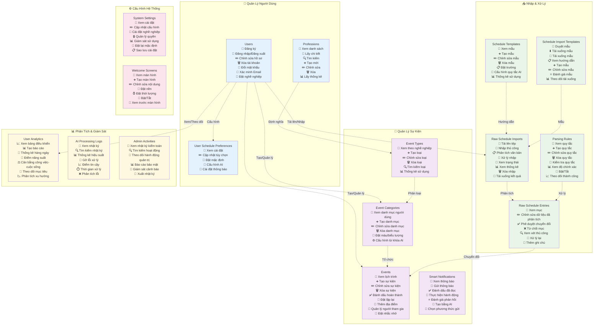

# Tài Liệu Cơ Sở Dữ Liệu

## Tổng Quan
Tài liệu này cung cấp một cái nhìn toàn diện về các bảng cơ sở dữ liệu tùy chỉnh cho API Quản Lý Lịch Trình, loại trừ các bảng hệ thống Laravel mặc định.

## Bảng và Mối Quan Hệ

### 1. **users** (Người dùng)
Bảng người dùng cốt lõi với các mở rộng liên quan đến nghề nghiệp.

| Trường | Kiểu | Ràng buộc | Mô tả |
|-------|------|------------|-------------|
| id | bigInteger | PRIMARY KEY, AUTO_INCREMENT | Định danh duy nhất của người dùng |
| name | string | NOT NULL | Tên đầy đủ của người dùng |
| email | string | UNIQUE, NOT NULL | Địa chỉ email của người dùng |
| email_verified_at | timestamp | NULLABLE | Thời gian xác minh email |
| password | string | NOT NULL | Mật khẩu đã băm |
| remember_token | string(100) | NULLABLE | Token ghi nhớ đăng nhập |
| profession_id | bigInteger | NULLABLE, FOREIGN KEY → professions.id | Nghề nghiệp của người dùng |
| profession_level | enum | NULLABLE | Cấp độ: student, resident, junior, senior, expert |
| workplace | string | NULLABLE | Nơi làm việc của người dùng |
| department | string | NULLABLE | Phòng ban của người dùng |
| work_schedule | json | NULLABLE | Cấu hình lịch làm việc |
| work_habits | json | NULLABLE | Thói quen và sở thích làm việc |
| notification_preferences | json | NULLABLE | Cài đặt thông báo |
| is_active | boolean | DEFAULT true | Trạng thái tài khoản hoạt động |
| created_at | timestamp | NOT NULL | Thời gian tạo bản ghi |
| updated_at | timestamp | NOT NULL | Thời gian cập nhật bản ghi |

**Mối quan hệ:**
- Thuộc về: `professions` (Nhiều-một)
- Có nhiều: `events`, `event_categories`, `smart_notifications`, `ai_processing_logs`, `user_analytics`, `raw_schedule_imports`, `admin_activities`
- Có một: `user_schedule_preferences`

---

### 2. **professions** (Nghề nghiệp)
Các danh mục nghề nghiệp xác định loại người dùng và hành vi.

| Trường | Kiểu | Ràng buộc | Mô tả |
|-------|------|------------|-------------|
| id | bigInteger | PRIMARY KEY, AUTO_INCREMENT | Định danh nghề nghiệp |
| name | string | UNIQUE | Tên mã nghề nghiệp |
| display_name | string | NOT NULL | Tên hiển thị |
| description | text | NULLABLE | Mô tả nghề nghiệp |
| default_categories | json | NULLABLE | Danh mục sự kiện mặc định |
| default_priorities | json | NULLABLE | Cài đặt ưu tiên mặc định |
| ai_keywords | json | NULLABLE | Từ khóa phát hiện AI |
| created_at | timestamp | NOT NULL | Thời gian tạo |
| updated_at | timestamp | NOT NULL | Thời gian cập nhật |

**Mối quan hệ:**
- Có nhiều: `users`, `event_types`, `schedule_templates`, `parsing_rules`, `schedule_import_templates`, `user_analytics`, `system_settings`

---

### 3. **event_types** (Loại sự kiện)
Định nghĩa loại sự kiện cụ thể theo nghề nghiệp.

| Trường | Kiểu | Ràng buộc | Mô tả |
|-------|------|------------|-------------|
| id | bigInteger | PRIMARY KEY, AUTO_INCREMENT | Định danh loại sự kiện |
| profession_id | bigInteger | FOREIGN KEY → professions.id | Nghề nghiệp liên kết |
| name | string | NOT NULL | Tên loại |
| display_name | string | NOT NULL | Tên hiển thị |
| description | text | NULLABLE | Mô tả loại |
| color | string(7) | NULLABLE | Mã màu hex |
| icon | string | NULLABLE | Định danh biểu tượng |
| default_priority | integer | DEFAULT 3 | Ưu tiên mặc định |
| ai_priority_weight | decimal(3,2) | DEFAULT 1.00 | Trọng số ưu tiên AI |
| keywords | json | NULLABLE | Từ khóa phát hiện |
| requires_preparation | boolean | DEFAULT false | Yêu cầu chuẩn bị |
| preparation_days | integer | DEFAULT 0 | Số ngày chuẩn bị |
| default_duration_minutes | integer | DEFAULT 60 | Thời lượng mặc định |
| allows_conflicts | boolean | DEFAULT false | Cho phép xung đột lịch |
| is_recurring_allowed | boolean | DEFAULT true | Cho phép lặp lại |
| created_at | timestamp | NOT NULL | Thời gian tạo |
| updated_at | timestamp | NOT NULL | Thời gian cập nhật |

**Ràng buộc duy nhất:** [profession_id, name]

**Mối quan hệ:**
- Thuộc về: `professions` (Nhiều-một)
- Có nhiều: `event_categories`

---

### 4. **event_categories** (Danh mục sự kiện)
Danh mục sự kiện cụ thể theo người dùng dựa trên loại sự kiện.

| Trường | Kiểu | Ràng buộc | Mô tả |
|-------|------|------------|-------------|
| id | bigInteger | PRIMARY KEY, AUTO_INCREMENT | Định danh danh mục |
| user_id | bigInteger | FOREIGN KEY → users.id | Người dùng sở hữu |
| event_type_id | bigInteger | NULLABLE, FOREIGN KEY → event_types.id | Loại sự kiện liên kết |
| name | string | NOT NULL | Tên danh mục |
| display_name | string | NOT NULL | Tên hiển thị |
| description | text | NULLABLE | Mô tả danh mục |
| color | string(7) | NULLABLE | Mã màu hex |
| icon | string | NULLABLE | Định danh biểu tượng |
| priority | integer | DEFAULT 3 | Ưu tiên mặc định |
| ai_priority_weight | decimal(3,2) | DEFAULT 1.00 | Trọng số ưu tiên AI |
| custom_keywords | json | NULLABLE | Từ khóa tùy chỉnh cho AI |
| preparation_days | integer | DEFAULT 0 | Số ngày chuẩn bị yêu cầu |
| is_active | boolean | DEFAULT true | Trạng thái hoạt động |
| created_at | timestamp | NOT NULL | Thời gian tạo |
| updated_at | timestamp | NOT NULL | Thời gian cập nhật |

**Mối quan hệ:**
- Thuộc về: `users` (Nhiều-một), `event_types` (Nhiều-một, tùy chọn)
- Có nhiều: `events`, được tham chiếu bởi `user_schedule_preferences`

---

### 5. **events** (Sự kiện)
Các mục sự kiện/lịch trình cốt lõi.

| Trường | Kiểu | Ràng buộc | Mô tả |
|-------|------|------------|-------------|
| id | bigInteger | PRIMARY KEY, AUTO_INCREMENT | Định danh sự kiện |
| user_id | bigInteger | FOREIGN KEY → users.id | Người dùng sở hữu |
| title | string | NOT NULL | Tiêu đề sự kiện |
| description | text | NULLABLE | Mô tả sự kiện |
| start_datetime | datetime | NOT NULL | Ngày và giờ bắt đầu |
| end_datetime | datetime | NOT NULL | Ngày và giờ kết thúc |
| location | string | NULLABLE | Địa điểm sự kiện |
| status | enum | DEFAULT 'scheduled' | Trạng thái: scheduled, in_progress, completed, cancelled, postponed |
| event_category_id | bigInteger | NULLABLE, FOREIGN KEY → event_categories.id | Danh mục sự kiện |
| priority | integer | DEFAULT 3 | Mức độ ưu tiên |
| ai_calculated_priority | decimal(5,2) | NULLABLE | Ưu tiên được tính bởi AI |
| importance_score | decimal(5,2) | NULLABLE | Điểm quan trọng |
| event_metadata | json | NULLABLE | Metadata bổ sung |
| participants | json | NULLABLE | Danh sách người tham gia |
| requirements | json | NULLABLE | Yêu cầu sự kiện |
| preparation_items | json | NULLABLE | Danh sách chuẩn bị |
| completion_percentage | integer | DEFAULT 0 | Phần trăm hoàn thành |
| recurring_pattern | json | NULLABLE | Mẫu lặp lại |
| parent_event_id | bigInteger | NULLABLE, FOREIGN KEY → events.id | Sự kiện cha cho lặp lại |
| created_at | timestamp | NOT NULL | Thời gian tạo |
| updated_at | timestamp | NOT NULL | Thời gian cập nhật |

**Chỉ mục:**
- idx_user_datetime: [user_id, start_datetime]
- idx_user_status: [user_id, status]
- idx_datetime_range: [start_datetime, end_datetime]

**Mối quan hệ:**
- Thuộc về: `users` (Nhiều-một), `event_categories` (Nhiều-một, tùy chọn), `events` (Nhiều-một, tự tham chiếu cho cha)
- Có nhiều: `smart_notifications`, `events` (sự kiện con), được tham chiếu bởi `raw_schedule_entries`

---

### 6. **smart_notifications** (Thông báo thông minh)
Hệ thống thông báo nâng cao với các tính năng AI.

| Trường | Kiểu | Ràng buộc | Mô tả |
|-------|------|------------|-------------|
| id | bigInteger | PRIMARY KEY, AUTO_INCREMENT | Định danh thông báo |
| event_id | bigInteger | NULLABLE, FOREIGN KEY → events.id | Sự kiện liên quan |
| user_id | bigInteger | FOREIGN KEY → users.id | Người dùng đích |
| type | enum | NOT NULL | Loại: reminder, preparation, priority_alert, conflict_warning, deadline_approach, followup |
| subtype | string | NULLABLE | Loại phụ thông báo |
| trigger_datetime | datetime | NOT NULL | Thời gian kích hoạt |
| scheduled_at | datetime | NULLABLE | Thời gian lên lịch gửi |
| sent_at | datetime | NULLABLE | Thời gian gửi thực tế |
| title | string | NOT NULL | Tiêu đề thông báo |
| message | text | NOT NULL | Nội dung thông báo |
| action_data | json | NULLABLE | Dữ liệu nút hành động/liên kết |
| ai_generated | boolean | DEFAULT false | Cờ tạo bởi AI |
| priority_level | integer | DEFAULT 3 | Mức độ ưu tiên |
| profession_specific_data | json | NULLABLE | Dữ liệu cụ thể theo nghề nghiệp |
| status | enum | DEFAULT 'pending' | Trạng thái: pending, sent, delivered, read, acted, failed |
| delivery_method | enum | DEFAULT 'in_app' | Phương thức: push, email, sms, in_app |
| opened_at | datetime | NULLABLE | Thời gian đọc |
| action_taken | boolean | DEFAULT false | Cờ đã thực hiện hành động |
| feedback_rating | integer | NULLABLE | Đánh giá phản hồi của người dùng |
| created_at | timestamp | NOT NULL | Thời gian tạo |
| updated_at | timestamp | NOT NULL | Thời gian cập nhật |

**Chỉ mục:**
- idx_trigger_time: [trigger_datetime]
- idx_notifications_user_status: [user_id, status]

**Mối quan hệ:**
- Thuộc về: `events` (Nhiều-một, tùy chọn), `users` (Nhiều-một)

---

### 7. **user_analytics** (Phân tích người dùng)
Phân tích và số liệu hàng ngày cho mỗi người dùng.

| Trường | Kiểu | Ràng buộc | Mô tả |
|-------|------|------------|-------------|
| id | bigInteger | PRIMARY KEY, AUTO_INCREMENT | Định danh bản ghi phân tích |
| user_id | bigInteger | FOREIGN KEY → users.id | Định danh người dùng |
| profession_id | bigInteger | NULLABLE, FOREIGN KEY → professions.id | Nghề nghiệp của người dùng |
| total_events | integer | DEFAULT 0 | Tổng số sự kiện |
| completed_events | integer | DEFAULT 0 | Số sự kiện hoàn thành |
| cancelled_events | integer | DEFAULT 0 | Số sự kiện hủy |
| high_priority_events | integer | DEFAULT 0 | Số sự kiện ưu tiên cao |
| total_scheduled_minutes | bigInteger | DEFAULT 0 | Tổng thời gian lên lịch |
| actual_worked_minutes | bigInteger | DEFAULT 0 | Thời gian làm việc thực tế |
| break_time_minutes | bigInteger | DEFAULT 0 | Thời gian nghỉ |
| overtime_minutes | bigInteger | DEFAULT 0 | Thời gian tăng ca |
| productivity_score | decimal(5,2) | NULLABLE | Điểm năng suất |
| stress_level | decimal(5,2) | NULLABLE | Chỉ báo mức độ căng thẳng |
| work_life_balance_score | decimal(5,2) | NULLABLE | Điểm cân bằng công việc-cuộc sống |
| ai_suggestions_given | integer | DEFAULT 0 | Số gợi ý AI |
| ai_suggestions_accepted | integer | DEFAULT 0 | Số gợi ý được chấp nhận |
| ai_accuracy_rate | decimal(5,4) | NULLABLE | Tỷ lệ chính xác AI |
| profession_metrics | json | NULLABLE | Số liệu cụ thể theo nghề nghiệp |
| analytics_date | date | NOT NULL | Ngày phân tích |
| created_at | timestamp | NOT NULL | Thời gian tạo |
| updated_at | timestamp | NOT NULL | Thời gian cập nhật |

**Ràng buộc duy nhất:** [user_id, analytics_date]

**Mối quan hệ:**
- Thuộc về: `users` (Nhiều-một), `professions` (Nhiều-một, tùy chọn)

---

### 8. **ai_processing_logs** (Nhật ký xử lý AI)
Nhật ký cho các hoạt động xử lý AI.

| Trường | Kiểu | Ràng buộc | Mô tả |
|-------|------|------------|-------------|
| id | bigInteger | PRIMARY KEY, AUTO_INCREMENT | Định danh nhật ký |
| user_id | bigInteger | FOREIGN KEY → users.id | Định danh người dùng |
| input_text | text | NOT NULL | Văn bản đầu vào được xử lý |
| input_type | enum | NOT NULL | Loại: schedule_parse, priority_analysis, conflict_detection, suggestion_generation |
| processed_data | json | NULLABLE | Dữ liệu kết quả xử lý |
| detected_keywords | json | NULLABLE | Từ khóa được phát hiện |
| profession_context | json | NULLABLE | Ngữ cảnh nghề nghiệp được sử dụng |
| confidence_score | decimal(5,4) | NULLABLE | Điểm tin cậy |
| priority_calculated | decimal(5,2) | NULLABLE | Ưu tiên được tính |
| processing_time_ms | integer | NULLABLE | Thời gian xử lý tính bằng ms |
| ai_model_version | string | NULLABLE | Phiên bản mô hình AI |
| success | boolean | DEFAULT true | Cờ thành công |
| error_message | text | NULLABLE | Thông báo lỗi nếu thất bại |
| created_at | timestamp | NOT NULL | Thời gian tạo |
| updated_at | timestamp | NOT NULL | Thời gian cập nhật |

**Chỉ mục:**
- idx_user_type: [user_id, input_type]

**Mối quan hệ:**
- Thuộc về: `users` (Nhiều-một)

---

### 9. **system_settings** (Cài đặt hệ thống)
Cài đặt cấu hình toàn hệ thống.

| Trường | Kiểu | Ràng buộc | Mô tả |
|-------|------|------------|-------------|
| id | bigInteger | PRIMARY KEY, AUTO_INCREMENT | Định danh cài đặt |
| category | string | NOT NULL | Danh mục cài đặt |
| key | string | NOT NULL | Khóa cài đặt |
| value | text | NOT NULL | Giá trị cài đặt |
| data_type | enum | DEFAULT 'string' | Loại: string, integer, boolean, json |
| description | text | NULLABLE | Mô tả cài đặt |
| profession_specific | bigInteger | NULLABLE, FOREIGN KEY → professions.id | Cài đặt cụ thể theo nghề nghiệp |
| is_public | boolean | DEFAULT false | Hiển thị công khai |
| updated_by | bigInteger | NULLABLE, FOREIGN KEY → users.id | Cập nhật lần cuối bởi |
| created_at | timestamp | NOT NULL | Thời gian tạo |
| updated_at | timestamp | NOT NULL | Thời gian cập nhật |

**Ràng buộc duy nhất:** [category, key, profession_specific]

**Mối quan hệ:**
- Thuộc về: `professions` (Nhiều-một, tùy chọn), `users` (Nhiều-một, updated_by)

---

### 10. **admin_activities** (Hoạt động quản trị)
Nhật ký kiểm toán hoạt động quản trị.

| Trường | Kiểu | Ràng buộc | Mô tả |
|-------|------|------------|-------------|
| id | bigInteger | PRIMARY KEY, AUTO_INCREMENT | Định danh hoạt động |
| admin_id | bigInteger | FOREIGN KEY → users.id | Định danh người dùng quản trị |
| action | string | NOT NULL | Hành động được thực hiện |
| target_type | string | NOT NULL | Loại thực thể đích |
| target_id | bigInteger | NULLABLE | ID thực thể đích |
| details | json | NULLABLE | Chi tiết hành động |
| ip_address | ipAddress | NULLABLE | Địa chỉ IP |
| user_agent | text | NULLABLE | User agent của trình duyệt |
| success | boolean | DEFAULT true | Cờ thành công |
| error_message | text | NULLABLE | Thông báo lỗi nếu thất bại |
| created_at | timestamp | NOT NULL | Thời gian tạo |
| updated_at | timestamp | NOT NULL | Thời gian cập nhật |

**Chỉ mục:**
- idx_admin_action: [admin_id, action]
- idx_target: [target_type, target_id]

**Mối quan hệ:**
- Thuộc về: `users` (Nhiều-một, admin)

---

### 11. **raw_schedule_imports** (Nhập lịch trình thô)
Theo dõi nhập lịch trình thô.

| Trường | Kiểu | Ràng buộc | Mô tả |
|-------|------|------------|-------------|
| id | bigInteger | PRIMARY KEY, AUTO_INCREMENT | Định danh nhập |
| user_id | bigInteger | FOREIGN KEY → users.id, CASCADE DELETE | Định danh người dùng |
| import_type | enum | NOT NULL | Loại: file_upload, manual_input, text_parsing, calendar_sync |
| source_type | enum | NOT NULL | Nguồn: csv, excel, txt, json, ics, manual |
| original_filename | string(255) | NULLABLE | Tên tệp gốc |
| file_size_bytes | integer | NULLABLE | Kích thước tệp tính bằng byte |
| mime_type | string(100) | NULLABLE | Loại MIME |
| raw_content | text | NULLABLE | Nội dung văn bản thô |
| raw_data | jsonb | NULLABLE | Dữ liệu thô dạng JSON |
| file_path | text | NULLABLE | Đường dẫn tệp được lưu |
| status | enum | DEFAULT 'pending' | Trạng thái: pending, processing, completed, failed |
| processing_started_at | timestamp | NULLABLE | Thời gian bắt đầu xử lý |
| processing_completed_at | timestamp | NULLABLE | Thời gian kết thúc xử lý |
| total_records_found | integer | DEFAULT 0 | Tổng số bản ghi tìm thấy |
| successfully_processed | integer | DEFAULT 0 | Số lượng xử lý thành công |
| failed_records | integer | DEFAULT 0 | Số bản ghi thất bại |
| error_log | jsonb | NULLABLE | Nhật ký lỗi |
| ai_confidence_score | decimal(3,2) | NULLABLE | Điểm tin cậy AI |
| detected_format | string(100) | NULLABLE | Định dạng được phát hiện |
| detected_profession | string(50) | NULLABLE | Nghề nghiệp được phát hiện |
| created_at | timestamp | NOT NULL | Thời gian tạo |
| updated_at | timestamp | NOT NULL | Thời gian cập nhật |

**Chỉ mục:**
- idx_raw_imports_user_status: [user_id, status]
- idx_raw_imports_type: [import_type, source_type]

**Mối quan hệ:**
- Thuộc về: `users` (Nhiều-một)
- Có nhiều: `raw_schedule_entries`

---

### 12. **raw_schedule_entries** (Các mục lịch trình thô)
Các mục riêng lẻ từ việc nhập lịch trình.

| Trường | Kiểu | Ràng buộc | Mô tả |
|-------|------|------------|-------------|
| id | bigInteger | PRIMARY KEY, AUTO_INCREMENT | Định danh mục |
| import_id | bigInteger | FOREIGN KEY → raw_schedule_imports.id, CASCADE DELETE | ID lô nhập |
| user_id | bigInteger | FOREIGN KEY → users.id, CASCADE DELETE | Định danh người dùng |
| row_number | integer | NULLABLE | Số hàng trong nhập |
| raw_text | text | NULLABLE | Văn bản thô |
| original_data | jsonb | NULLABLE | Dữ liệu gốc |
| parsed_title | string(255) | NULLABLE | Tiêu đề được phân tích |
| parsed_description | text | NULLABLE | Mô tả được phân tích |
| parsed_start_datetime | timestamp | NULLABLE | Ngày giờ bắt đầu được phân tích |
| parsed_end_datetime | timestamp | NULLABLE | Ngày giờ kết thúc được phân tích |
| parsed_location | string(255) | NULLABLE | Địa điểm được phân tích |
| parsed_priority | integer | NULLABLE | Ưu tiên được phân tích |
| detected_keywords | jsonb | NULLABLE | Từ khóa được phát hiện |
| ai_parsed_data | jsonb | NULLABLE | Dữ liệu được phân tích bởi AI |
| ai_confidence | decimal(3,2) | NULLABLE | Độ tin cậy AI |
| ai_detected_category | string(100) | NULLABLE | Danh mục được phát hiện bởi AI |
| ai_detected_importance | decimal(3,2) | NULLABLE | Mức độ quan trọng được phát hiện bởi AI |
| processing_status | enum | DEFAULT 'pending' | Trạng thái: pending, parsed, converted, failed |
| conversion_status | enum | DEFAULT 'pending' | Trạng thái: pending, success, failed, manual_review |
| converted_event_id | bigInteger | NULLABLE, FOREIGN KEY → events.id, SET NULL | ID sự kiện đã chuyển đổi |
| parsing_errors | jsonb | NULLABLE | Lỗi phân tích |
| manual_review_required | boolean | DEFAULT false | Cờ yêu cầu xem xét thủ công |
| manual_review_notes | text | NULLABLE | Ghi chú xem xét |
| created_at | timestamp | NOT NULL | Thời gian tạo |
| updated_at | timestamp | NOT NULL | Thời gian cập nhật |

**Chỉ mục:**
- idx_raw_entries_import_user: [import_id, user_id]
- idx_raw_entries_conversion_status: [conversion_status]
- idx_raw_entries_manual_review: [manual_review_required]

**Mối quan hệ:**
- Thuộc về: `raw_schedule_imports` (Nhiều-một), `users` (Nhiều-một), `events` (Nhiều-một, sau khi chuyển đổi)

---

### 13. **schedule_templates** (Mẫu lịch trình)
Mẫu cho việc nhập lịch trình.

| Trường | Kiểu | Ràng buộc | Mô tả |
|-------|------|------------|-------------|
| id | bigInteger | PRIMARY KEY, AUTO_INCREMENT | Định danh mẫu |
| profession_id | bigInteger | NULLABLE, FOREIGN KEY → professions.id | Liên kết nghề nghiệp |
| created_by | bigInteger | NULLABLE, FOREIGN KEY → users.id | Người dùng tạo |
| name | string(255) | NOT NULL | Tên mẫu |
| description | text | NULLABLE | Mô tả mẫu |
| template_type | enum | NOT NULL | Loại: csv_format, text_pattern, json_schema |
| field_mapping | jsonb | NULLABLE | Cấu hình ánh xạ trường |
| required_fields | jsonb | NULLABLE | Danh sách trường bắt buộc |
| optional_fields | jsonb | NULLABLE | Danh sách trường tùy chọn |
| default_values | jsonb | NULLABLE | Giá trị mặc định |
| date_formats | jsonb | NULLABLE | Mẫu định dạng ngày |
| time_formats | jsonb | NULLABLE | Mẫu định dạng thời gian |
| keyword_patterns | jsonb | NULLABLE | Mẫu từ khóa |
| validation_rules | jsonb | NULLABLE | Quy tắc xác thực |
| ai_processing_rules | jsonb | NULLABLE | Quy tắc xử lý AI |
| usage_count | integer | DEFAULT 0 | Số lần sử dụng |
| success_rate | decimal(3,2) | NULLABLE | Tỷ lệ thành công |
| is_active | boolean | DEFAULT true | Trạng thái hoạt động |
| is_default | boolean | DEFAULT false | Cờ mẫu mặc định |
| created_at | timestamp | NOT NULL | Thời gian tạo |
| updated_at | timestamp | NOT NULL | Thời gian cập nhật |

**Chỉ mục:**
- idx_templates_profession_active: [profession_id, is_active]
- idx_templates_type: [template_type]

**Mối quan hệ:**
- Thuộc về: `professions` (Nhiều-một, tùy chọn), `users` (Nhiều-một, created_by)
- Được tham chiếu bởi: `user_schedule_preferences`

---

### 14. **user_schedule_preferences** (Tùy chọn lịch trình người dùng)
Tùy chọn người dùng cho việc nhập lịch trình.

| Trường | Kiểu | Ràng buộc | Mô tả |
|-------|------|------------|-------------|
| id | bigInteger | PRIMARY KEY, AUTO_INCREMENT | Định danh tùy chọn |
| user_id | bigInteger | UNIQUE, FOREIGN KEY → users.id, CASCADE DELETE | Định danh người dùng |
| preferred_import_format | enum | DEFAULT 'csv' | Định dạng: csv, excel, txt, json |
| default_template_id | bigInteger | NULLABLE, FOREIGN KEY → schedule_templates.id | Mẫu mặc định |
| timezone_preference | string(50) | DEFAULT 'Asia/Ho_Chi_Minh' | Múi giờ |
| date_format_preference | string(20) | DEFAULT 'dd/mm/yyyy' | Định dạng ngày |
| time_format_preference | string(20) | DEFAULT 'HH:mm' | Định dạng thời gian |
| ai_auto_categorize | boolean | DEFAULT true | Cờ phân loại tự động |
| ai_auto_priority | boolean | DEFAULT true | Cờ ưu tiên tự động |
| ai_confidence_threshold | decimal(3,2) | DEFAULT 0.7 | Ngưỡng tin cậy AI |
| default_event_duration_minutes | integer | DEFAULT 60 | Thời lượng mặc định |
| default_priority | integer | DEFAULT 3 | Ưu tiên mặc định |
| default_category_id | bigInteger | NULLABLE, FOREIGN KEY → event_categories.id | Danh mục mặc định |
| notify_on_import_completion | boolean | DEFAULT true | Thông báo nhập hoàn thành |
| notify_on_parsing_errors | boolean | DEFAULT true | Thông báo lỗi phân tích |
| custom_field_mappings | jsonb | NULLABLE | Ánh xạ tùy chỉnh |
| custom_keywords | jsonb | NULLABLE | Từ khóa tùy chỉnh |
| created_at | timestamp | NOT NULL | Thời gian tạo |
| updated_at | timestamp | NOT NULL | Thời gian cập nhật |

**Mối quan hệ:**
- Thuộc về: `users` (Một-một), `schedule_templates` (Nhiều-một, tùy chọn), `event_categories` (Nhiều-một, tùy chọn)

---

### 15. **parsing_rules** (Quy tắc phân tích)
Quy tắc cho việc phân tích dữ liệu lịch trình.

| Trường | Kiểu | Ràng buộc | Mô tả |
|-------|------|------------|-------------|
| id | bigInteger | PRIMARY KEY, AUTO_INCREMENT | Định danh quy tắc |
| rule_name | string(255) | NOT NULL | Tên quy tắc |
| profession_id | bigInteger | NULLABLE, FOREIGN KEY → professions.id | Liên kết nghề nghiệp |
| rule_type | enum | NOT NULL | Loại: keyword_detection, pattern_matching, priority_calculation, category_assignment |
| rule_pattern | text | NOT NULL | Mẫu quy tắc/regex |
| rule_action | jsonb | NOT NULL | Cấu hình hành động |
| conditions | jsonb | NULLABLE | Điều kiện quy tắc |
| priority_order | integer | DEFAULT 100 | Ưu tiên xử lý |
| positive_examples | jsonb | NULLABLE | Ví dụ tích cực |
| negative_examples | jsonb | NULLABLE | Ví dụ tiêu cực |
| accuracy_rate | decimal(3,2) | NULLABLE | Tỷ lệ chính xác |
| usage_count | integer | DEFAULT 0 | Số lần sử dụng |
| success_count | integer | DEFAULT 0 | Số lần thành công |
| is_active | boolean | DEFAULT true | Trạng thái hoạt động |
| created_by | bigInteger | NULLABLE, FOREIGN KEY → users.id | Người dùng tạo |
| created_at | timestamp | NOT NULL | Thời gian tạo |
| updated_at | timestamp | NOT NULL | Thời gian cập nhật |

**Chỉ mục:**
- idx_parsing_rules_profession_type: [profession_id, rule_type]
- idx_parsing_rules_priority_active: [priority_order, is_active]

**Mối quan hệ:**
- Thuộc về: `professions` (Nhiều-một, tùy chọn), `users` (Nhiều-một, created_by)

---

### 16. **schedule_import_templates** (Mẫu nhập lịch trình)
Mẫu cho người dùng tải xuống để nhập lịch trình.

| Trường | Kiểu | Ràng buộc | Mô tả |
|-------|------|------------|-------------|
| id | bigInteger | PRIMARY KEY, AUTO_INCREMENT | Định danh mẫu |
| profession_id | bigInteger | NULLABLE, FOREIGN KEY → professions.id | Liên kết nghề nghiệp |
| template_name | string(255) | NOT NULL | Tên mẫu |
| template_description | text | NULLABLE | Mô tả mẫu |
| file_type | enum | NOT NULL | Loại: csv, excel, json, txt |
| template_version | string(20) | DEFAULT '1.0' | Phiên bản mẫu |
| sample_title | string(255) | NULLABLE | Tiêu đề mẫu |
| sample_description | text | NULLABLE | Mô tả mẫu |
| sample_start_datetime | string(50) | NULLABLE | Ngày giờ bắt đầu mẫu |
| sample_end_datetime | string(50) | NULLABLE | Ngày giờ kết thúc mẫu |
| sample_location | string(255) | NULLABLE | Địa điểm mẫu |
| sample_priority | string(20) | NULLABLE | Ưu tiên mẫu |
| sample_category | string(100) | NULLABLE | Danh mục mẫu |
| sample_keywords | text | NULLABLE | Từ khóa mẫu |
| date_format_example | string(50) | NULLABLE | Ví dụ định dạng ngày |
| time_format_example | string(50) | NULLABLE | Ví dụ định dạng thời gian |
| required_columns | jsonb | NULLABLE | Cột bắt buộc |
| optional_columns | jsonb | NULLABLE | Cột tùy chọn |
| column_descriptions | jsonb | NULLABLE | Mô tả cột |
| template_file_path | text | NULLABLE | Đường dẫn tệp mẫu |
| sample_data_file_path | text | NULLABLE | Đường dẫn tệp dữ liệu mẫu |
| instructions_file_path | text | NULLABLE | Đường dẫn tệp hướng dẫn |
| ai_keywords_examples | jsonb | NULLABLE | Ví dụ từ khóa AI |
| priority_detection_rules | jsonb | NULLABLE | Quy tắc phát hiện ưu tiên |
| category_mapping_examples | jsonb | NULLABLE | Ví dụ ánh xạ danh mục |
| download_count | integer | DEFAULT 0 | Số lần tải xuống |
| success_import_rate | decimal(3,2) | NULLABLE | Tỷ lệ nhập thành công |
| user_feedback_rating | decimal(2,1) | NULLABLE | Đánh giá phản hồi người dùng |
| is_active | boolean | DEFAULT true | Trạng thái hoạt động |
| is_default | boolean | DEFAULT false | Cờ mẫu mặc định |
| created_by | bigInteger | NULLABLE, FOREIGN KEY → users.id | Người dùng tạo |
| created_at | timestamp | NOT NULL | Thời gian tạo |
| updated_at | timestamp | NOT NULL | Thời gian cập nhật |

**Chỉ mục:**
- idx_profession_active_templates: [profession_id, is_active]
- idx_file_type: [file_type]

**Mối quan hệ:**
- Thuộc về: `professions` (Nhiều-một, tùy chọn), `users` (Nhiều-một, created_by)

---

### 17. **welcome_screens** (Màn hình chào mừng)
Cấu hình màn hình chào mừng.

| Trường | Kiểu | Ràng buộc | Mô tả |
|-------|------|------------|-------------|
| id | bigInteger | PRIMARY KEY, AUTO_INCREMENT | Định danh màn hình |
| title | string | NOT NULL | Tiêu đề màn hình |
| subtitle | string | NULLABLE | Phụ đề màn hình |
| background_type | enum | NOT NULL | Loại: color, image, video |
| background_value | text | NOT NULL | Giá trị/đường dẫn nền |
| duration | integer | NOT NULL | Thời lượng hiển thị tính bằng giây |
| is_active | boolean | DEFAULT false | Trạng thái hoạt động |
| created_at | timestamp | NOT NULL | Thời gian tạo |
| updated_at | timestamp | NOT NULL | Thời gian cập nhật |

**Chỉ mục:**
- idx_welcome_screens_active: [is_active]

**Mối quan hệ:** Không có (bảng cấu hình độc lập)

---

## Tóm Tắt Mối Quan Hệ Chính

### **Luồng Người Dùng Cốt Lõi:**
1. **User** → thuộc về → **Profession**
2. **User** → có một → **User Schedule Preferences**
3. **User** → có nhiều → **Events**
4. **User** → có nhiều → **Event Categories**

### **Quản Lý Sự Kiện:**
1. **Profession** → có nhiều → **Event Types**
2. **Event Types** → có nhiều → **Event Categories**
3. **Event Categories** → có nhiều → **Events**
4. **Events** → tự tham chiếu cho các sự kiện lặp lại (cha/con)

### **Luồng Nhập:**
1. **User** → có nhiều → **Raw Schedule Imports**
2. **Raw Schedule Imports** → có nhiều → **Raw Schedule Entries**
3. **Raw Schedule Entries** → chuyển đổi thành → **Events**

### **AI & Phân Tích:**
1. **User** → có nhiều → **AI Processing Logs**
2. **User** → có nhiều → **User Analytics**
3. **User** → có nhiều → **Smart Notifications**

### **Cấu Hình:**
1. **Profession** → có nhiều → **Schedule Templates**
2. **Profession** → có nhiều → **Parsing Rules**
3. **Profession** → có nhiều → **System Settings**

## Loại Mối Quan Hệ:

- **1:1 (Một-một):** User ↔ User Schedule Preferences
- **1:N (Một-nhiều):** User → Events, User → Event Categories, Profession → Event Types, v.v.
- **N:1 (Nhiều-một):** Events → User, Event Categories → User, Users → Profession, v.v.
- **Tự Tham Chiếu:** Events (parent_event_id cho sự kiện lặp lại)

---

## Sơ Đồ Mối Quan Hệ Cơ Sở Dữ liệu Trực Quan

```mermaid
graph TB
    %% Quản lý người dùng cốt lõi
    subgraph "Quản Lý Người Dùng"
        U[Users<br/>Người dùng]
        P[Professions<br/>Nghề nghiệp]
        USP[User Schedule Preferences<br/>Tùy chọn lịch trình người dùng]
    end

    %% Quản lý sự kiện
    subgraph "Hệ Thống Sự Kiện"
        ET[Event Types<br/>Loại sự kiện]
        EC[Event Categories<br/>Danh mục sự kiện]
        E[Events<br/>Sự kiện]
        SN[Smart Notifications<br/>Thông báo thông minh]
    end

    %% Hệ thống nhập
    subgraph "Nhập & Xử Lý"
        RSI[Raw Schedule Imports<br/>Nhập lịch trình thô]
        RSE[Raw Schedule Entries<br/>Các mục lịch trình thô]
        ST[Schedule Templates<br/>Mẫu lịch trình]
        SIT[Schedule Import Templates<br/>Mẫu nhập lịch trình]
        PR[Parsing Rules<br/>Quy tắc phân tích]
    end

    %% Phân tích & Nhật ký
    subgraph "Phân Tích & Giám Sát"
        UA[User Analytics<br/>Phân tích người dùng]
        APL[AI Processing Logs<br/>Nhật ký xử lý AI]
        AA[Admin Activities<br/>Hoạt động quản trị]
    end

    %% Cấu hình
    subgraph "Cấu Hình Hệ Thống"
        SS[System Settings<br/>Cài đặt hệ thống]
        WS[Welcome Screens<br/>Màn hình chào mừng]
    end

    %% Đường quan hệ với nhãn

    %% Mối quan hệ 1:1
    U -.->|"1:1"| USP

    %% Người dùng đến Nhiều (1:N)
    U -->|"1:N"| E
    U -->|"1:N"| EC
    U -->|"1:N"| SN
    U -->|"1:N"| RSI
    U -->|"1:N"| UA
    U -->|"1:N"| APL
    U -->|"1:N"| AA
    U -->|"1:N (created_by)"| ST
    U -->|"1:N (created_by)"| SIT
    U -->|"1:N (created_by)"| PR
    U -->|"1:N (updated_by)"| SS

    %% Nhiều đến Người dùng (N:1)
    E -.->|"N:1"| U
    EC -.->|"N:1"| U
    SN -.->|"N:1"| U
    RSI -.->|"N:1"| U
    UA -.->|"N:1"| U
    APL -.->|"N:1"| U
    AA -.->|"N:1"| U

    %% Người dùng đến Nghề nghiệp (N:1)
    U -.->|"N:1"| P

    %% Nghề nghiệp đến Nhiều (1:N)
    P -->|"1:N"| ET
    P -->|"1:N"| ST
    P -->|"1:N"| SIT
    P -->|"1:N"| PR
    P -->|"1:N"| SS
    P -->|"1:N"| UA

    %% Loại sự kiện đến Danh mục sự kiện (1:N)
    ET -->|"1:N"| EC

    %% Danh mục sự kiện đến Sự kiện (1:N)
    EC -->|"1:N"| E

    %% Sự kiện đến Danh mục sự kiện (N:1)
    E -.->|"N:1"| EC

    %% Sự kiện đến Thông báo thông minh (1:N)
    E -->|"1:N"| SN

    %% Thông báo thông minh đến Sự kiện (N:1)
    SN -.->|"N:1"| E

    %% Tự tham chiếu Sự kiện (lặp lại)
    E -->|"1:N (cha/con)"| E

    %% Luồng quy trình nhập
    RSI -->|"1:N"| RSE
    RSE -.->|"N:1"| RSI
    RSE -.->|"N:1 (chuyển đổi thành)"| E

    %% Tham chiếu tùy chọn người dùng
    USP -.->|"N:1 (mẫu mặc định)"| ST
    USP -.->|"N:1 (danh mục mặc định)"| EC

    %% Tạo kiểu
    classDef userMgmt fill:#e1f5fe
    classDef eventSys fill:#f3e5f5
    classDef importSys fill:#e8f5e8
    classDef analytics fill:#fff3e0
    classDef config fill:#fce4ec

    class U,P,USP userMgmt
    class ET,EC,E,SN eventSys
    class RSI,RSE,ST,SIT,PR importSys
    class UA,APL,AA analytics
    class SS,WS config
```



## Ma Trận Mối Quan Hệ Chi Tiết

### **Mối quan hệ 1:1 (Một-một)**
| Bảng 1 | Mối quan hệ | Bảng 2 | Mô tả |
|---------|--------------|---------|-------------|
| Users | ↔ | User Schedule Preferences | Mỗi người dùng có đúng một bản ghi tùy chọn |

### **Mối quan hệ 1:N (Một-nhiều)**
| Bảng Cha | Mối quan hệ | Bảng Con | Khóa Ngoại | Mô tả |
|--------------|--------------|-------------|-------------|-------------|
| **Users** | → | Events | user_id | Người dùng có thể có nhiều sự kiện |
| **Users** | → | Event Categories | user_id | Người dùng có thể tạo nhiều danh mục |
| **Users** | → | Smart Notifications | user_id | Người dùng có thể nhận nhiều thông báo |
| **Users** | → | Raw Schedule Imports | user_id | Người dùng có thể nhập nhiều lịch trình |
| **Users** | → | User Analytics | user_id | Người dùng có thể có nhiều phân tích hàng ngày |
| **Users** | → | AI Processing Logs | user_id | Người dùng có thể có nhiều nhật ký xử lý AI |
| **Users** | → | Admin Activities | admin_id | Người dùng quản trị có thể thực hiện nhiều hoạt động |
| **Users** | → | Schedule Templates | created_by | Người dùng có thể tạo nhiều mẫu |
| **Users** | → | Schedule Import Templates | created_by | Người dùng có thể tạo nhiều mẫu nhập |
| **Users** | → | Parsing Rules | created_by | Người dùng có thể tạo nhiều quy tắc phân tích |
| **Users** | → | System Settings | updated_by | Người dùng có thể cập nhật nhiều cài đặt |
| **Professions** | → | Users | profession_id | Nghề nghiệp có thể có nhiều người dùng |
| **Professions** | → | Event Types | profession_id | Nghề nghiệp có thể định nghĩa nhiều loại sự kiện |
| **Professions** | → | Schedule Templates | profession_id | Nghề nghiệp có thể có nhiều mẫu |
| **Professions** | → | Schedule Import Templates | profession_id | Nghề nghiệp có thể có nhiều mẫu nhập |
| **Professions** | → | Parsing Rules | profession_id | Nghề nghiệp có thể có nhiều quy tắc phân tích |
| **Professions** | → | System Settings | profession_specific | Nghề nghiệp có thể có nhiều cài đặt cụ thể |
| **Professions** | → | User Analytics | profession_id | Nghề nghiệp có thể có nhiều bản ghi phân tích |
| **Event Types** | → | Event Categories | event_type_id | Loại sự kiện có thể có nhiều danh mục |
| **Event Categories** | → | Events | event_category_id | Danh mục có thể chứa nhiều sự kiện |
| **Events** | → | Smart Notifications | event_id | Sự kiện có thể kích hoạt nhiều thông báo |
| **Events** | → | Events | parent_event_id | Sự kiện có thể có nhiều sự kiện con (lặp lại) |
| **Raw Schedule Imports** | → | Raw Schedule Entries | import_id | Nhập có thể chứa nhiều mục |

### **Mối quan hệ N:1 (Nhiều-một)**
| Bảng Con | Mối quan hệ | Bảng Cha | Khóa Ngoại | Mô tả |
|-------------|--------------|--------------|-------------|-------------|
| **Users** | ← | Professions | profession_id | Nhiều người dùng thuộc một nghề nghiệp |
| **Events** | ← | Users | user_id | Nhiều sự kiện thuộc một người dùng |
| **Events** | ← | Event Categories | event_category_id | Nhiều sự kiện thuộc một danh mục |
| **Events** | ← | Events | parent_event_id | Nhiều sự kiện con thuộc một sự kiện cha |
| **Event Categories** | ← | Users | user_id | Nhiều danh mục thuộc một người dùng |
| **Event Categories** | ← | Event Types | event_type_id | Nhiều danh mục thuộc một loại |
| **Event Types** | ← | Professions | profession_id | Nhiều loại thuộc một nghề nghiệp |
| **Smart Notifications** | ← | Users | user_id | Nhiều thông báo thuộc một người dùng |
| **Smart Notifications** | ← | Events | event_id | Nhiều thông báo thuộc một sự kiện |
| **Raw Schedule Imports** | ← | Users | user_id | Nhiều lần nhập thuộc một người dùng |
| **Raw Schedule Entries** | ← | Raw Schedule Imports | import_id | Nhiều mục thuộc một lần nhập |
| **Raw Schedule Entries** | ← | Users | user_id | Nhiều mục thuộc một người dùng |
| **Raw Schedule Entries** | ← | Events | converted_event_id | Nhiều mục chuyển đổi thành một sự kiện |
| **User Schedule Preferences** | ← | Users | user_id | Một tùy chọn thuộc một người dùng |
| **User Schedule Preferences** | ← | Schedule Templates | default_template_id | Nhiều tùy chọn sử dụng một mẫu |
| **User Schedule Preferences** | ← | Event Categories | default_category_id | Nhiều tùy chọn sử dụng một danh mục |
| **Schedule Templates** | ← | Professions | profession_id | Nhiều mẫu thuộc một nghề nghiệp |
| **Schedule Templates** | ← | Users | created_by | Nhiều mẫu được tạo bởi một người dùng |
| **Schedule Import Templates** | ← | Professions | profession_id | Nhiều mẫu nhập thuộc một nghề nghiệp |
| **Schedule Import Templates** | ← | Users | created_by | Nhiều mẫu nhập được tạo bởi một người dùng |
| **Parsing Rules** | ← | Professions | profession_id | Nhiều quy tắc thuộc một nghề nghiệp |
| **Parsing Rules** | ← | Users | created_by | Nhiều quy tắc được tạo bởi một người dùng |
| **User Analytics** | ← | Users | user_id | Nhiều phân tích thuộc một người dùng |
| **User Analytics** | ← | Professions | profession_id | Nhiều phân tích thuộc một nghề nghiệp |
| **AI Processing Logs** | ← | Users | user_id | Nhiều nhật ký thuộc một người dùng |
| **Admin Activities** | ← | Users | admin_id | Nhiều hoạt động được thực hiện bởi một quản trị viên |
| **System Settings** | ← | Professions | profession_specific | Nhiều cài đặt thuộc một nghề nghiệp |
| **System Settings** | ← | Users | updated_by | Nhiều cài đặt được cập nhật bởi một người dùng |

### **Ký hiệu Mối quan hệ Sử dụng:**
- **→** : Một-nhiều (1:N)
- **←** : Nhiều-một (N:1)  
- **↔** : Một-một (1:1)
- **--** : Đường quan hệ trực tiếp
- **-.->** : Đường quan hệ ngược/trả về

### **Mẫu Luồng Dữ Liệu Chính:**

#### **Luồng Tập Trung Người Dùng:**
```
User → Profession → Event Types → Event Categories → Events → Smart Notifications
```

#### **Luồng Nhập:**
```
User → Raw Schedule Imports → Raw Schedule Entries → Events
```

#### **Luồng Xử Lý AI:**
```
User Input → AI Processing Logs → Events/Categories → User Analytics
```

#### **Luồng Sử Dụng Mẫu:**
```
Profession → Schedule Templates → User Schedule Preferences → Import Process
```

---

## Chức Năng & Hoạt Động Bảng Cơ Sở Dữ Liệu



## Ma Trận Chức Năng Bảng Chi Tiết

### **👤 Quản Lý Người Dùng**

| Bảng | Chức năng chính | Hoạt động chính |
|-------|------------------|----------------|
| **users** | Quản lý tài khoản người dùng | 📝 Đăng ký, 🔐 Đăng nhập/Đăng xuất, ✏️ Chỉnh sửa hồ sơ, 🗑️ Xóa tài khoản, 🔄 Đổi mật khẩu, 📧 Xác minh Email, 👔 Đặt nghề nghiệp |
| **professions** | Quản lý nghề nghiệp | 👀 Xem danh sách, 📖 Lấy chi tiết, 🔍 Tìm kiếm, ➕ Tạo mới, ✏️ Chỉnh sửa, 🗑️ Xóa, 📊 Lấy thống kê |
| **user_schedule_preferences** | Cấu hình tùy chọn người dùng | 👀 Xem cài đặt, ✏️ Cập nhật tùy chọn, 🎯 Đặt mặc định, 🔧 Cấu hình AI, 📱 Cài đặt thông báo |

### **📅 Quản Lý Sự Kiện**

| Bảng | Chức năng chính | Hoạt động chính |
|-------|------------------|----------------|
| **event_types** | Định nghĩa loại sự kiện | 👀 Xem theo nghề nghiệp, ➕ Tạo loại, ✏️ Chỉnh sửa loại, 🗑️ Xóa loại, 🔍 Tìm kiếm loại, 📊 Thống kê sử dụng |
| **event_categories** | Phân loại cụ thể theo người dùng | 👀 Xem danh mục người dùng, ➕ Tạo danh mục, ✏️ Chỉnh sửa danh mục, 🗑️ Xóa danh mục, 🎨 Đặt màu/biểu tượng, ⚙️ Cấu hình từ khóa AI |
| **events** | Quản lý lịch trình | 👀 Xem lịch trình, ➕ Tạo sự kiện, ✏️ Chỉnh sửa sự kiện, 🗑️ Xóa sự kiện, ✅ Đánh dấu hoàn thành, 🔄 Đặt lặp lại, 📍 Thêm địa điểm, 👥 Quản lý người tham gia, 🔔 Đặt nhắc nhở |
| **smart_notifications** | Thông báo thông minh | 👀 Xem thông báo, 📨 Gửi thông báo, ✅ Đánh dấu đã đọc, 🎯 Thực hiện hành động, ⭐ Đánh giá phản hồi, 🤖 Tạo bằng AI, 📱 Chọn phương thức gửi |

### **📥 Nhập & Xử Lý**

| Bảng | Chức năng chính | Hoạt động chính |
|-------|------------------|----------------|
| **raw_schedule_imports** | Quản lý nhập tệp | 📁 Tải lên tệp, 📝 Nhập thủ công, 📋 Phân tích văn bản, 🔄 Xử lý nhập, 👀 Xem trạng thái, 📊 Xem thống kê, 🗑️ Xóa nhập, 📄 Tải xuống kết quả |
| **raw_schedule_entries** | Xử lý mục nhập | 👀 Xem mục, ✏️ Chỉnh sửa dữ liệu đã phân tích, ✅ Phê duyệt chuyển đổi, ❌ Từ chối mục, 🔍 Xem xét thủ công, 🔄 Xử lý lại, 📝 Thêm ghi chú |
| **schedule_templates** | Cấu hình mẫu | 👀 Xem mẫu, ➕ Tạo mẫu, ✏️ Chỉnh sửa mẫu, 🗑️ Xóa mẫu, 📋 Đặt trường, 🤖 Cấu hình quy tắc AI, 📊 Thống kê sử dụng |
| **schedule_import_templates** | Phân phối mẫu | 👀 Duyệt mẫu, ⬇️ Tải xuống mẫu, 📄 Tải xuống mẫu, 📋 Xem hướng dẫn, ➕ Tạo mẫu, ✏️ Chỉnh sửa mẫu, ⭐ Đánh giá mẫu, 📊 Theo dõi tải xuống |
| **parsing_rules** | Quy tắc phân tích dữ liệu | 👀 Xem quy tắc, ➕ Tạo quy tắc, ✏️ Chỉnh sửa quy tắc, 🗑️ Xóa quy tắc, 🧪 Kiểm tra quy tắc, 📊 Xem độ chính xác, 🔄 Bật/Tắt, 📈 Theo dõi thành công |

### **📊 Phân Tích & Giám Sát**

| Bảng | Chức năng chính | Hoạt động chính |
|-------|------------------|----------------|
| **user_analytics** | Theo dõi hiệu suất người dùng | 📈 Xem bảng điều khiển, 📊 Tạo báo cáo, 📅 Thống kê hàng ngày, 💪 Điểm năng suất, ⚖️ Cân bằng công việc-cuộc sống, 🎯 Theo dõi mục tiêu, 📉 Phân tích xu hướng |
| **ai_processing_logs** | Giám sát hoạt động AI | 👀 Xem nhật ký, 🔍 Tìm kiếm nhật ký, 📊 Thống kê hiệu suất, 🐛 Gỡ lỗi xử lý, 📈 Điểm tin cậy, ⏱️ Thời gian xử lý, ❌ Phân tích lỗi |
| **admin_activities** | Theo dõi kiểm toán hệ thống | 👀 Xem nhật ký kiểm toán, 🔍 Tìm kiếm hoạt động, 👤 Theo dõi hành động quản trị, 📊 Báo cáo bảo mật, 🚨 Giám sát cảnh báo, 📄 Xuất nhật ký |

### **⚙️ Cấu Hình Hệ Thống**

| Bảng | Chức năng chính | Hoạt động chính |
|-------|------------------|----------------|
| **system_settings** | Cấu hình hệ thống | 👀 Xem cài đặt, ✏️ Cập nhật cấu hình, 🔧 Cài đặt nghề nghiệp, 🔒 Quản lý quyền, 📊 Giám sát sử dụng, 🔄 Đặt lại mặc định, 📋 Sao lưu cài đặt |
| **welcome_screens** | Màn hình giao diện người dùng | 👀 Xem màn hình, ➕ Tạo màn hình, ✏️ Chỉnh sửa nội dung, 🎨 Đặt nền, ⏰ Đặt thời lượng, 🔄 Bật/Tắt, 👀 Xem trước màn hình |

## **Danh Mục Chức Năng:**

### **📝 Hoạt động CRUD**
- **Tạo:** Thêm bản ghi mới (➕)
- **Đọc:** Xem và tìm kiếm dữ liệu (👀, 🔍)
- **Cập nhật:** Chỉnh sửa bản ghi hiện có (✏️)
- **Xóa:** Xóa bản ghi (🗑️)

### **📁 Hoạt động Tệp**
- **Tải lên:** Nhập tệp (📁)
- **Tải xuống:** Xuất dữ liệu/mẫu (⬇️)
- **Xử lý:** Phân tích và chuyển đổi dữ liệu (🔄)

### **🤖 Hoạt động AI**
- **Tạo:** Tạo nội dung bằng AI (🤖)
- **Phân tích:** Xử lý và chấm điểm AI (📊)
- **Cấu hình:** Thiết lập quy tắc và từ khóa AI (⚙️)

### **📊 Hoạt động Phân Tích**
- **Theo dõi:** Giám sát sử dụng và hiệu suất (📈)
- **Báo cáo:** Tạo thông tin chi tiết và thống kê (📊)
- **Bảng điều khiển:** Trình bày dữ liệu trực quan (📈)

### **🔧 Hoạt động Cấu Hình**
- **Cài đặt:** Tùy chọn hệ thống và người dùng (🔧)
- **Mẫu:** Cấu hình có thể tái sử dụng (📋)
- **Quy tắc:** Thiết lập logic nghiệp vụ (⚙️)

### **📱 Hoạt động Giao Diện Người Dùng**
- **Thông báo:** Hệ thống cảnh báo và nhắn tin (📨)
- **Phản hồi:** Đánh giá và nhận xét của người dùng (⭐)
- **Điều hướng:** Duyệt và tìm kiếm (🔍)

Tổng quan chức năng này cho thấy chính xác những gì mỗi bảng làm và những hoạt động nào người dùng có thể thực hiện với mỗi thực thể trong API Quản Lý Lịch Trình của bạn.