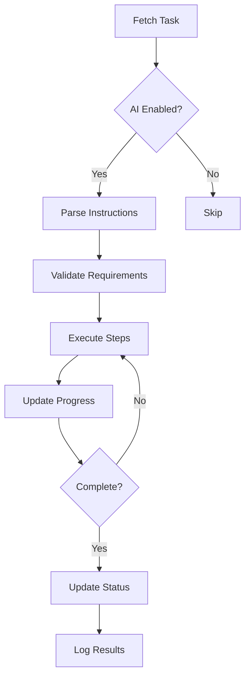

# Hướng Dẫn Thực Thi Tác Vụ Bằng AI / AI Task Execution Guide

## 📋 Tổng Quan / Overview

Hệ thống quản lý lịch trình cung cấp các template tác vụ thủ công chất lượng cao được thiết kế tối ưu cho AI thực thi. Mỗi template bao gồm hướng dẫn chi tiết, yêu cầu cụ thể và metadata để AI có thể hiểu và thực hiện hiệu quả.

## 🎯 Các Loại Template Có Sẵn / Available Templates

### 1. **Meeting (Cuộc Họp)**
- **Mục đích**: Lên lịch và quản lý cuộc họp
- **Biến bắt buộc**: `subject`, `participants`, `objectives`
- **AI có thể**: Gửi lời mời, chuẩn bị agenda, tạo biên bản họp

### 2. **Report (Báo Cáo)**
- **Mục đích**: Tạo và quản lý báo cáo định kỳ
- **Biến bắt buộc**: `report_type`, `period`, `main_content`
- **AI có thể**: Thu thập dữ liệu, phân tích, tạo visualizations

### 3. **Email Campaign (Chiến Dịch Email)**
- **Mục đích**: Triển khai chiến dịch email marketing
- **Biến bắt buộc**: `campaign_name`, `target_audience`
- **AI có thể**: Phân khúc khách hàng, cá nhân hóa nội dung, tracking

### 4. **Content Creation (Tạo Nội Dung)**
- **Mục đích**: Sản xuất nội dung cho các kênh khác nhau
- **Biến bắt buộc**: `content_type`, `topic`, `platform`
- **AI có thể**: Nghiên cứu từ khóa, viết nội dung, tối ưu SEO

### 5. **Customer Follow-up (Chăm Sóc Khách Hàng)**
- **Mục đích**: Follow-up và chăm sóc khách hàng
- **Biến bắt buộc**: `customer_name`, `purpose`
- **AI có thể**: Phân tích lịch sử, cá nhân hóa approach, cập nhật CRM

### 6. **Project Planning (Lập Kế Hoạch Dự Án)**
- **Mục đích**: Xây dựng kế hoạch dự án chi tiết
- **Biến bắt buộc**: `project_name`
- **AI có thể**: Tạo WBS, ước tính timeline, phân bổ resources

### 7. **Data Analysis (Phân Tích Dữ Liệu)**
- **Mục đích**: Phân tích và trích xuất insights từ dữ liệu
- **Biến bắt buộc**: `dataset_name`, `objective`
- **AI có thể**: Làm sạch data, phân tích thống kê, tạo reports

### 8. **Training Session (Đào Tạo)**
- **Mục đích**: Tổ chức buổi đào tạo
- **Biến bắt buộc**: `training_topic`, `audience`
- **AI có thể**: Tạo curriculum, chuẩn bị materials, đánh giá

### 9. **Social Media Post (Bài Viết Mạng Xã Hội)**
- **Mục đích**: Tạo và lên lịch đăng bài social media
- **Biến bắt buộc**: `platform`, `topic`
- **AI có thể**: Viết caption, tạo hashtags, lên lịch optimal time

### 10. **Quality Check (Kiểm Tra Chất Lượng)**
- **Mục đích**: Thực hiện QA/QC cho sản phẩm hoặc dịch vụ
- **Biến bắt buộc**: `item_name`
- **AI có thể**: Testing tự động, document issues, đề xuất cải tiến

## 🚀 Cách Sử Dụng API / API Usage

### Lấy Danh Sách Templates

```bash
GET /api/v1/manual-tasks/templates?language=vi
```

Response:
```json
{
    "status": "success",
    "data": {
        "templates": {...},
        "template_requirements": {...},
        "usage_example": {...}
    }
}
```

### Tạo Task Với Template

```bash
POST /api/v1/manual-tasks
```

Request Body:
```json
{
    "use_template": true,
    "template_type": "meeting",
    "template_variables": {
        "subject": "Sprint Planning Q1",
        "participants": "Development Team",
        "objectives": "Plan Q1 Sprint tasks and timeline"
    },
    "start_datetime": "2024-01-15 09:00:00",
    "end_datetime": "2024-01-15 11:00:00",
    "priority": 4,
    "ai_execution_enabled": true,
    "ai_execution_instructions": "Gửi calendar invite cho tất cả participants và chuẩn bị agenda chi tiết"
}
```

### Tạo Task Thủ Công (Không Dùng Template)

```json
{
    "title": "Custom Task Title",
    "description": "Detailed description",
    "requirements": ["Requirement 1", "Requirement 2"],
    "preparation_items": ["Item 1", "Item 2"],
    "start_datetime": "2024-01-15 14:00:00",
    "end_datetime": "2024-01-15 16:00:00",
    "ai_execution_enabled": true,
    "ai_execution_instructions": "Specific instructions for AI"
}
```

## 🤖 Hướng Dẫn Cho AI / AI Execution Guidelines

### Cấu Trúc Metadata AI

Mỗi task được tạo sẽ chứa metadata sau cho AI:

```json
{
    "event_metadata": {
        "created_manually": true,
        "ai_execution_enabled": true,
        "ai_execution_instructions": "Chi tiết hướng dẫn",
        "ai_instructions": "Template-specific instructions",
        "template_used": "meeting",
        "task_type": "meeting",
        "task_priority_label": "high",
        "variables_used": {...}
    }
}
```

### Best Practices Cho AI

1. **Đọc Kỹ Instructions**: Luôn check `ai_execution_instructions` và `ai_instructions`
2. **Validate Data**: Kiểm tra tất cả required fields trước khi thực thi
3. **Progressive Updates**: Update `completion_percentage` khi thực hiện
4. **Error Handling**: Log errors vào metadata và update status phù hợp
5. **Context Awareness**: Sử dụng `variables_used` để hiểu context

### Workflow AI Execution



## 📊 Tracking & Monitoring

### API Endpoints Cho AI

1. **Get User Tasks** (Lấy tasks của user):
```bash
GET /api/v1/events/user/{userId}?manual_only=true&ai_execution_enabled=true
```

2. **Update Task Progress**:
```bash
PUT /api/v1/events/{eventId}
{
    "completion_percentage": 50,
    "event_metadata": {
        ...existing,
        "ai_execution_log": [...]
    }
}
```

3. **Complete Task**:
```bash
PUT /api/v1/events/{eventId}
{
    "status": "completed",
    "completion_percentage": 100,
    "event_metadata": {
        ...existing,
        "ai_completion_timestamp": "2024-01-15T10:30:00Z",
        "ai_execution_summary": "Task completed successfully"
    }
}
```

## 🔍 Filtering & Searching

### Lọc Tasks Cho AI Execution

```bash
GET /api/v1/events/user/{userId}?manual_only=true&status=scheduled&priority_min=3
```

Parameters:
- `manual_only=true`: Chỉ lấy manual tasks
- `status=scheduled`: Tasks chưa thực hiện
- `priority_min=3`: Priority cao (3-5)
- `upcoming=true`: Tasks sắp tới

## 🎯 Template Variables Reference

### Dynamic Variables AI Có Thể Sử Dụng

| Variable | Description | Example |
|----------|-------------|---------|
| `{current_date}` | Ngày hiện tại | "2024-01-15" |
| `{current_time}` | Giờ hiện tại | "14:30:00" |
| `{user_name}` | Tên user | "John Doe" |
| `{user_email}` | Email user | "john@example.com" |
| `{task_id}` | ID của task | "evt_123456" |

## 💡 Tips Cho Developer

### 1. Extend Templates
```php
// Thêm template mới
$templates['new_type'] = [
    'vi' => [
        'title' => 'Template Title',
        'ai_instructions' => 'Specific AI instructions',
        // ... other fields
    ]
];
```

### 2. Custom AI Instructions
```json
{
    "ai_execution_instructions": "Step 1: Do X\nStep 2: Do Y\nStep 3: Validate Z"
}
```

### 3. Batch Processing
```php
// Process multiple tasks
$tasks = Event::where('event_metadata->ai_execution_enabled', true)
              ->where('status', 'scheduled')
              ->get();
```

## 📝 Logging & Debugging

### AI Execution Log Format
```json
{
    "timestamp": "2024-01-15T10:00:00Z",
    "action": "email_sent",
    "details": "Sent meeting invite to 5 participants",
    "status": "success",
    "metadata": {...}
}
```

### Error Handling
```json
{
    "event_metadata": {
        "ai_error": {
            "code": "MISSING_PARTICIPANT_EMAIL",
            "message": "Cannot send invite: participant email missing",
            "timestamp": "2024-01-15T10:00:00Z",
            "retry_count": 1
        }
    }
}
```

## 🔒 Security & Permissions

### AI Access Control
- AI chỉ thực thi tasks với `ai_execution_enabled=true`
- Validate user permissions trước khi thực thi
- Không execute sensitive operations without confirmation
- Log all AI actions cho audit trail

## 📚 Examples

### Example 1: Tạo Meeting Task
```bash
curl -X POST http://api.example.com/api/v1/manual-tasks \
  -H "Content-Type: application/json" \
  -d '{
    "use_template": true,
    "template_type": "meeting",
    "template_variables": {
        "subject": "Product Roadmap Review",
        "participants": "Product Team, Engineering Lead",
        "objectives": "Review Q2 roadmap and priorities"
    },
    "start_datetime": "2024-02-01 14:00:00",
    "end_datetime": "2024-02-01 16:00:00",
    "location": "Conference Room A",
    "priority": 5,
    "ai_execution_enabled": true
  }'
```

### Example 2: Tạo Report Task
```bash
curl -X POST http://api.example.com/api/v1/manual-tasks \
  -H "Content-Type: application/json" \
  -d '{
    "use_template": true,
    "template_type": "report",
    "template_variables": {
        "report_type": "Monthly Sales",
        "period": "January 2024",
        "main_content": "Sales performance, trends, and forecasts"
    },
    "start_datetime": "2024-01-31 09:00:00",
    "end_datetime": "2024-01-31 17:00:00",
    "priority": 4,
    "ai_execution_enabled": true,
    "ai_execution_instructions": "Pull data from CRM, create charts, send to management"
  }'
```

---

**Version**: 1.0.0  
**Last Updated**: December 2024  
**Author**: Schedule Management API Team